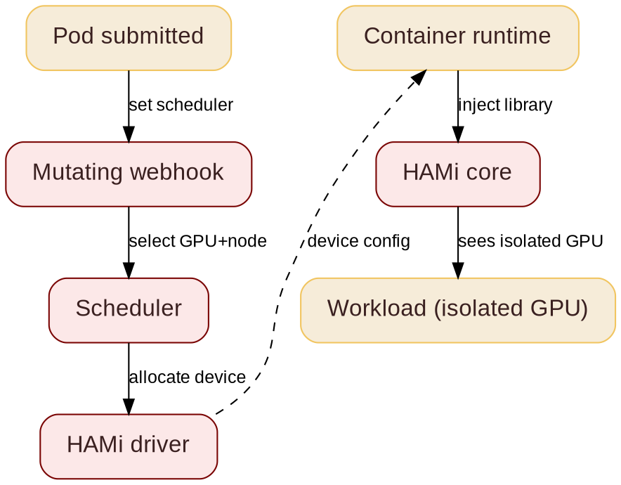

@variant dark
@kicker COSCUP 2026  -  Track: Golang TW x Cloud Native
@side-image assets/coscup26/qr_code_coscup2026.png
# Running Multiple AI Workloads on One GPU with HAMi

@subtitle Architecture and Gotchas

@speaker name="Reza Jelveh" role="Solution Architect, Dynamia AI  -  Makers of HAMi" github=github.com/fishman linkedin=linkedin.com/in/rezajelveh

---

# Part 1: The Problem

@subtitle GPUs are expensive, and Kubernetes does not share them well

---

@layout image-right

## The Problem

@subtitle One GPU per task is the default

Kubernetes allocates GPUs atomically: one whole device, one task.

- A 1 GB task blocks an 80 GB device
- Most GPUs sit idle most of the time
- DRA (Dynamic Resource Allocation) is stable, but still work in progress
- No advanced scheduling yet: no binpack, no spread, no topology


---

## What is HAMi

@subtitle Before: one GPU, one task

<!--
GPUs are expensive and often underutilized. HAMi is a heterogeneous GPU sharing framework for Kubernetes. It slices GPUs and shares them across workloads, without rewriting your stack.
-->


---

## What is HAMi
@transition none

@subtitle After: one GPU, many tasks


---

@layout compare

## The GPU Challenge

@subtitle What breaks, what HAMi solves

::: card {tag=compare}
### Problem

- GPUs are scarce, allocated whole
- Utilization stuck at 10%
- No central observability
- Fragmented inference workloads
:::

::: arrow

{icon:arrow-right cls=accent-primary size=48}
:::

::: card {tag=compare}
### Requirements

- One API, any accelerator
- Fine-grained slices, many tasks per device
- Advanced scheduling: binpack, spread, topology
- Unified observability across vendors
:::

<!--
Heterogeneous GPU sharing means one cluster can run NVIDIA, Ascend, Cambricon and other devices without manual partitioning. HAMi handles the scheduling. The real work is memory isolation, which we cover next.
-->

---

# Part 2: The Architecture

@subtitle No code changes. No kernel modules. No vendor lock-in.

---

@layout two-col

## How HAMi Works

@subtitle From pod submission to isolated GPU

<!--
Five stages from pod submission to isolated GPU. The mutating webhook routes the pod, the scheduler picks a device, the HAMi core library enforces isolation in the container.
-->

- **Mutating webhook:** sees GPU requests, routes pod to HAMi scheduler
- **Scheduler:** selects GPU and node
- **HAMi driver:** generates device config
- **Container runtime:** reads config, injects HAMi-Core library
- **HAMi core:** enforces isolation in-process

@col



---

@layout two-col

## The Magic: CUDA Hijacking

@subtitle Your app does not change

<!--
HAMi ships a small library. The container runtime loads it before your app starts. It intercepts CUDA calls and replies with your slice. No code changes, no kernel modules, no driver changes.
-->

Your app calls CUDA. HAMi answers with a slice of the GPU.

- Small library loaded before your app (`LD_PRELOAD`)
- Intercepts CUDA calls, no app code changes
- No kernel modules, no driver changes
- Works for any framework: PyTorch, TensorFlow, vLLM

@col


---

## Why Memory Isolation Matters

@subtitle One bad task must not kill its neighbors

<!--
Without isolation, one workload can grab all memory and OOM-kill the other tasks on the same GPU. HAMi cuts memory at the driver level: every task sees only its own slice. Compute is time-sliced, best-effort.
-->

::: grid {cols=2}
::: card {tag=red}
### {icon:triangle-alert cls=accent-secondary} Without HAMi

Tasks share a GPU with no borders. One greedy task eats all memory and kills the neighbors. Multi-tenant means risky.
:::
::: card {tag=green}
### {icon:shield-check cls=accent-primary} With HAMi

Each task sees only its slice. Memory is a hard limit, cut at the driver level. Compute is time-sliced: best-effort, but fair.
:::
::: card {tag=yellow}
### {icon:refresh-cw cls=accent-contrast} Oversubscription

Idle memory can be swapped to host RAM, so more models fit. Great for inference, not for active training.
:::
::: card {tag=cyan}
### {icon:gauge cls=accent-contrast} Per-task limits

```yaml
resources:
  limits:
    nvidia.com/gpu: 1
    nvidia.com/gpumem: 3000
```
3 GB slice on any GPU. Same YAML works for Ascend, Cambricon and more.
:::
:::

---

## GPU Sharing Approaches

@subtitle MIG vs HAMi vs NVIDIA DRA

<!--
Common question: why not just use MIG? MIG does not work on all devices and needs manual templates. NVIDIA DRA supports MIG, MPS and VFIO, but has no advanced scheduling. HAMi adds symbolic hijacking for sub-MIG slicing and multi-vendor support.
-->

| Capability | MIG | HAMi | NVIDIA DRA |
|------------|:---:|:---:|:---:|
| Sub-MIG slicing | {icon:x cls=accent-secondary} | {icon:check cls=accent-primary} | {icon:x cls=accent-secondary} |
| Dynamic repartition | {icon:x cls=accent-secondary} | {icon:check cls=accent-primary} | {icon:check cls=accent-primary} |
| Multi-vendor | {icon:x cls=accent-secondary} | {icon:check cls=accent-primary} | {icon:x cls=accent-secondary} |
| Advanced scheduling | {icon:x cls=accent-secondary} | {icon:check cls=accent-primary} | {icon:x cls=accent-secondary} |
| No code changes | {icon:x cls=accent-secondary} | {icon:check cls=accent-primary} | {icon:x cls=accent-secondary} |

HAMi differentiates with symbolic hijacking (1 MiB granularity on NVIDIA), consumable capacities for flexible requests, and multi-vendor support. HAMi-DRA builds on NVIDIA's upstream DRA driver and supports multiple DRA drivers.

---

@layout image-right

## Scheduling Policies

@subtitle Binpack & spread, on nodes and GPUs

<!--
Two axes, four patterns. Node binpack saves money, node spread saves uptime. GPU binpack saves whole GPUs for training, GPU spread protects tail latency. Pick based on workload.
-->


- **Node binpack:** frees whole machines, cuts cost
- **Node spread:** isolates faults, HA across zones
- **GPU binpack:** frees whole GPUs for training
- **GPU spread:** protects tail latency, less HBM/NVLink contention

---

@layout image-right

## Topology-Aware Scheduling

@subtitle NVLink is fast. PCIe is not.

<!--
NVLink versus PCIe is a 7-14x bandwidth gap. HAMi places multi-GPU workloads on NVLink-connected pairs and avoids PCIe bridge pairs. The same topology logic applies to Ascend (HCCS) and other high-speed interconnects.
-->


- **NVLink (H100):** 900 GB/s, 18 links
- **PCIe 5.0 x16:** 128 GB/s, ~7x slower
- HAMi pairs GPUs over the fast links
- Same logic for Ascend (HCCS) and others

---

## Gotchas

@subtitle What surprised us, so it will not surprise you

<!--
Four real-world gotchas. Memory is a hard limit but compute is best-effort. Oversubscription is for inference, not training. Granularity differs per vendor. DRA is young: stable APIs, but no advanced scheduling yet.
-->

::: grid {cols=2}
::: card {tag=red}
### {icon:gauge cls=accent-secondary} Memory is hard, compute is not

Your memory slice is guaranteed. Compute is time-sliced: best-effort, not reserved. Plan for it.
:::
::: card {tag=yellow}
### {icon:refresh-cw cls=accent-contrast} Oversubscription has limits

Swap idle memory to host RAM fits more models. Use it for inference, not for active training.
:::
::: card {tag=cyan}
### {icon:layers cls=accent-primary} Granularity varies by vendor

NVIDIA slices down to 1 MiB memory and 1% compute. Other vendors define their own units. Check your device.
:::
::: card {tag=green}
### {icon:git-branch cls=accent-primary} DRA is young

Kubernetes DRA is stable, but advanced scheduling is still missing. HAMi fills that gap today.
:::
:::

---

# Part 3: Production Use Cases

@subtitle What real teams do with HAMi

---

@layout metrics
## Where HAMi Is Today

@subtitle Production metrics from CNCF case studies

::: grid {cols=4}
::: card {metric}
100%
Hardware pool utilization
Baike Holdings
:::
::: card {metric}
10x
GPU utilization in CI
NIO
:::
::: card {metric}
30%
Fewer GPU hours
China Merchants Bank
:::
::: card {metric}
10,000+
Pods running concurrently
Baike Holdings
:::
:::

@row

::: notes{ tag="green" }
China Merchants Bank - SNOW Corp. - NIO - KE Holdings - DaoCloud - SF Technology - Prep Education - [cncf.io/case-studies](https://www.cncf.io/case-studies/)
:::

---

## Real Results

@subtitle Teams cut GPU costs by 40-60%

<!--
Adopters report 40-60% lower GPU cost. The savings come from three places: more workloads per GPU, tighter scheduling, and turning GPUs off when idle.
-->

- {icon:trending-down cls=accent-primary} 40-60% lower GPU cost, reported by adopters
- {icon:layers cls=accent-primary} Up to 10x more workloads on the same hardware

::: grid {cols=3}
::: card {tag=green}
### {icon:layers cls=accent-primary} Share

Many tasks on one GPU. Small jobs no longer block big devices.
:::
::: card {tag=cyan}
### {icon:git-branch cls=accent-contrast} Schedule

Binpack and spread policies pack work tightly onto fewer GPUs.
:::
::: card {tag=yellow}
### {icon:trending-down cls=accent-secondary} Scale

Elastic scaling turns GPUs off when they are idle.
:::
:::

---

@layout ecosystem
## Community & Adopters

@subtitle Devices, integrations, and who uses HAMi

<!--
4.1k stars, 325k pulls, 500+ contributors, 27 countries. 11 device types, 20+ adopters. This is the ecosystem slide: show the breadth. The QR code links to github.com/Project-HAMi/HAMi.
-->

#### Open Source, CNCF Backed, Production Ready
::: grid {cols=5}
::: card {metric}
4.1k
Github Stars
:::
::: card {metric}
325k
Docker Pulls
:::
::: card {metric}
500+
Contributors
:::
::: card {metric}
27
Contributor Countries
:::
::: card

     
:::
:::

#### Ecosystem & Device Support
::: grid {cols=2}
::: card
    
   
 
:::
:::

#### Adopters
::: grid {cols=2}
::: card
    
    
    
    
:::
:::

---

## Who This Is For

@subtitle K8s operators, platform engineers, anyone watching GPUs sit idle

<!--
Three audiences. K8s operators: one resource field, no new API. Platform engineers: share GPUs without touching app code. And anyone watching GPUs sit idle: you can pack them.
-->

::: grid {cols=3}
::: card {tag=green}
### {icon:cpu cls=accent-primary} K8s Operators

One extra resource field in the pod spec. No new API to learn.
:::
::: card {tag=cyan}
### {icon:shield-check cls=accent-contrast} Platform Engineers

Share GPUs across teams and vendors, without touching app code.
:::
::: card {tag=yellow}
### {icon:gauge cls=accent-contrast} GPU Watchers

Idle GPUs are wasted money. Pack them with HAMi.
:::
:::

---

## Demo

@subtitle 3 nodes x 2 A100s: MIG, YOLO, and two vLLMs

<!--
3 nodes with 2 A100s each. One configured for MIG, one running a bunch of YOLO workloads, and two vLLMs scheduled on top. Watch how HAMi packs and isolates them. Video plays inline; PDF shows a frame.
-->

@video assets/demo/llm_test.mp4

---

@kicker Thank You
@side-image assets/coscup26/qr_code_coscup2026.png
# Questions? Try HAMi

@subtitle github.com/Project-HAMi/HAMi

@speaker name="Reza Jelveh" role="Solution Architect, Dynamia AI  -  Makers of HAMi" github=github.com/fishman linkedin=linkedin.com/in/rezajelveh
