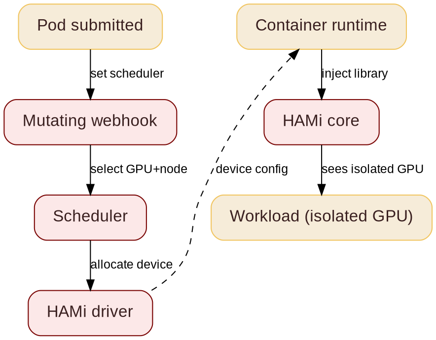

@variant dark
@kicker COSCUP 2026  -  Track: Golang TW x Cloud Native
@side-image assets/coscup26/qr_code_coscup2026.png
# Running Multiple AI Workloads on One GPU with HAMi

@subtitle Architecture and Gotchas

@speaker name="Reza Jelveh" role="Solution Architect, Dynamia AI  -  Makers of HAMi" github=github.com/fishman linkedin=linkedin.com/in/rezajelveh

---

# Part 1: The Problem

@subtitle GPUs are expensive, and Kubernetes does not share them well

---

@layout image-right

## The Problem

@subtitle One GPU per task is the default

Kubernetes allocates GPUs atomically: one whole device, one task.

- A 1 GB task blocks an 80 GB device
- Most GPUs sit idle most of the time
- DRA (Dynamic Resource Allocation) is stable, but still work in progress
- No advanced scheduling yet: no binpack, no spread, no topology


---

## What is HAMi

@subtitle Before: one GPU, one task

<!--
GPUs are expensive and often underutilized. HAMi is a heterogeneous GPU sharing framework for Kubernetes. It slices GPUs and shares them across workloads, without rewriting your stack.
-->


---

## What is HAMi
@transition none

@subtitle After: one GPU, many tasks


---

@layout compare

## The GPU Challenge

@subtitle What breaks, what HAMi needs to solve

::: card {tag=compare}
### Problem

- GPUs are scarce, allocated whole
- Vendors locked in, supply tight
- Utilization stuck at 10%
- No central observability
- Fragmented inference workloads
:::

::: arrow

{icon:arrow-right cls=accent-primary size=48}
:::

::: card {tag=compare}
### Requirements

- Hardware agnostic: one API, any accelerator
- Fractional GPU: fine-grained slices, multiple tasks per device
- Advanced scheduling: binpack, spread, topology-aware
- Unified observability across vendors
:::

<!--
Heterogeneous GPU sharing means you can run NVIDIA A100s, H100s, Ascend or other devices on the same cluster without manual partitioning. HAMi handles the scheduling logic. The real work is memory isolation.
-->

::: notes{ tag="green" }
Unified observability, 50% GPU utilization, 10x workloads running, 10x GPU availability. AMD MI355X: 80% of B200 perf at ~1/3 the cost. Not everyone needs Vera Rubin.
:::


@layout compare


---

# Part 2: The Solution

@subtitle No code changes. No kernel modules. No vendor lock-in.

---

## DRA Feature Timeline

@subtitle KEPs and their development status: not covered today

<!--
Backup slide. Shows all DRA KEPs and their dev status. Mention that DRA is moving fast -- 1.34 stable. We will skip this but it is here for questions.
-->


---

@layout image-right

## DRA: ResourceSlice

@subtitle Per-node device inventory

<!--
DRA drivers run on each node and publish available devices. The scheduler reads ResourceSlices to find nodes that can satisfy a claim. This is how the scheduler knows what hardware is free.
-->


- **ResourceSlice:** lists all available devices on a node with their attributes
- DRA drivers publish slices; scheduler reads them to match claims to devices
- Tied to a node via `nodeName`, supports topology and NUMA attributes

---

@layout image-right

## DRA: ResourceClaim

@subtitle A standardized way to request hardware: not just GPUs. Stable in K8s 1.34.

<!--
DeviceClass defines a category of devices by capability. ResourceClaim requests specific hardware from that category. ResourceClaimTemplate creates a claim per pod automatically. Together these replace the old device plugin model.
-->


- **DeviceClass:** groups devices with identical resource models. **ResourceClaim:** a workload's ticket to hardware. **ResourceClaimTemplate:** reusable blueprint, auto-creates a claim per Pod.

---

## HAMi Capabilities

@subtitle Six things HAMi brings to GPU scheduling

<!--
Six capabilities. The key ones for this talk: hard isolation, advanced scheduling, and unified monitoring. Heterogeneous management is the differentiator -- not just NVIDIA.
-->

::: grid {cols=2}
::: card
### {icon:layers cls=accent-primary} Heterogeneous Management

Manage GPU, NPU, MLU, and other accelerators in one workflow.
:::
::: card
### {icon:shield-check cls=accent-primary} Hard Isolation

Slice memory and compute with hard isolation at runtime.
:::
::: card
### {icon:git-branch cls=accent-contrast} Advanced Scheduling

Binpack, spread, and topology-aware placement policies.
:::
::: card
### {icon:box cls=accent-primary} Kubernetes Native

Kubernetes-native APIs, DRA, and CDI support.
:::
::: card
### {icon:gauge cls=accent-primary} Resource Isolation & QoS

Memory and core quotas for fair, stable sharing.
:::
::: card
### {icon:chart-bar cls=accent-contrast} Unified Monitoring

Consistent metrics and visibility across vendors.
:::
:::

---

@layout two-col

## GPU Sharing

@subtitle Dynamic fine-grained device slicing

<!--
Same YAML across vendors. Ascend example on the right. Memory is hard limit, cores are best-effort. This is what users actually write.
-->

- **NVIDIA, Ascend, Cambricon, Hygon, Iluvatar** supported
- **Fine-grained:** as small as 1MB device memory, 1% computing cores
- **Transparent to tasks:** no code changes required
- **Hard resource isolation** inside containers
- One API across vendors: same YAML, any accelerator

@col

```yaml
# Ascend 910C: 8GB + 20% compute
resources:
  limits:
    huawei.com/Ascend910C: "1"
    huawei.com/Ascend910C-core: "20"
    huawei.com/Ascend910C-memory: "8192"
```

```yaml
# NVIDIA: 3GB on any GPU
resources:
  limits:
    nvidia.com/gpu: 1
    nvidia.com/gpumem: 3000
```

---

@layout two-col

## How HAMi Works

@subtitle From pod submission to isolated GPU

<!--
Five stages from pod submission to isolated GPU. The mutating webhook routes the pod, the scheduler picks a device, the HAMi core library enforces isolation in the container.
-->

- **Mutating webhook:** sees GPU requests, routes pod to HAMi scheduler
- **Scheduler:** selects GPU and node
- **HAMi driver:** generates device config
- **Container runtime:** reads config, injects HAMi-Core library
- **HAMi core:** enforces isolation in-process

@col



---

@layout two-col

## The Magic: CUDA Hijacking

@subtitle Your app does not change

<!--
HAMi ships a small library. The container runtime loads it before your app starts. It intercepts CUDA calls and replies with your slice. No code changes, no kernel modules, no driver changes.
-->

Your app calls CUDA. HAMi answers with a slice of the GPU.

- Small library loaded before your app (`LD_PRELOAD`)
- Intercepts CUDA calls, no app code changes
- No kernel modules, no driver changes
- Works for any framework: PyTorch, TensorFlow, vLLM

@col


---

## Why Memory Isolation Matters

@subtitle One bad task must not kill its neighbors

<!--
Without isolation, one workload can grab all memory and OOM-kill the other tasks on the same GPU. HAMi enforces memory when it hijacks the CUDA API calls: every task sees only its own slice.
-->

::: grid {cols=2}
::: card {tag=red}
### {icon:triangle-alert cls=accent-secondary} Without HAMi

Tasks share a GPU with no borders. One greedy task eats all memory and kills the neighbors. Multi-tenant means risky.
:::
::: card {tag=green}
### {icon:shield-check cls=accent-primary} With HAMi

Each task sees only its slice. Memory is a hard limit, enforced by the hijacked CUDA calls: every allocation is checked against your slice.
:::
::: card {tag=yellow}
### {icon:refresh-cw cls=accent-contrast} Oversubscription

Idle memory can be swapped to host RAM, so more models fit. Great for inference, not for active training.
:::
::: card {tag=cyan}
### {icon:gauge cls=accent-contrast} Per-task limits

```yaml
resources:
  limits:
    nvidia.com/gpu: 1
    nvidia.com/gpumem: 3000
```
3 GB slice on any GPU. Same YAML works for Ascend, Cambricon and more.
:::
:::

---

## GPU Sharing Approaches

@subtitle MIG vs HAMi vs NVIDIA DRA

<!--
Common question: why not just use MIG? MIG does not work on all devices and needs manual templates. NVIDIA DRA supports MIG, MPS and VFIO, but has no advanced scheduling. HAMi adds symbolic hijacking for sub-MIG slicing and multi-vendor support.
-->

| Capability | MIG | HAMi | NVIDIA DRA |
|------------|:---:|:---:|:---:|
| Sub-MIG slicing | {icon:x cls=accent-secondary} | {icon:check cls=accent-primary} | {icon:x cls=accent-secondary} |
| Dynamic repartition | {icon:x cls=accent-secondary} | {icon:check cls=accent-primary} | {icon:check cls=accent-primary} |
| Multi-vendor | {icon:x cls=accent-secondary} | {icon:check cls=accent-primary} | {icon:x cls=accent-secondary} |
| Advanced scheduling | {icon:x cls=accent-secondary} | {icon:check cls=accent-primary} | {icon:x cls=accent-secondary} |
| No code changes | {icon:x cls=accent-secondary} | {icon:check cls=accent-primary} | {icon:x cls=accent-secondary} |

HAMi differentiates with symbolic hijacking (1 MiB granularity on NVIDIA), consumable capacities for flexible requests, and multi-vendor support. HAMi-DRA builds on NVIDIA's upstream DRA driver and supports multiple DRA drivers.

---

## Consumable Capacities

@subtitle GPU resources as a pool you draw from

<!--
GPU resources are consumable: memory in MiB, compute in % of the GPU's SMs. The scheduler tracks remaining capacity per device and packs by it. HAMi-core enforces the ceiling on hijacked CUDA calls; nvidia-smi inside the pod shows your slice, not the card. Since v2.8 the same semantics exist on the DRA path (ResourceSlice typed capacities, ResourceClaims).
-->

::: grid {cols=2}
::: card {tag=cyan}
### {icon:gauge cls=accent-primary} Memory and compute, separate axes

Request MiB of VRAM and percent of the GPU's SMs. What you use is what you get, no fixed profiles.
:::
::: card {tag=green}
### {icon:layers cls=accent-primary} Scheduler packs by remaining capacity

Every GPU reports memory and compute left. Binpack and spread policies fit requests into the gaps.
:::
::: card {tag=yellow}
### {icon:shield-check cls=accent-contrast} Enforced on hijacked calls

HAMi-core caps every allocation at your slice. Inside the pod, nvidia-smi shows 0 MiB / 4000 MiB.
:::
::: card {tag=red}
### {icon:git-branch cls=accent-contrast} Same semantics on DRA (v2.8+)

Typed ResourceSlice capacities (memory step 1 MiB, cores 0-100). Requests become ResourceClaims.
:::
:::

@row

```yaml
resources:
  limits:
    nvidia.com/gpu: 1          # one vGPU slice
    nvidia.com/gpumem: 4000    # 4000 MiB of VRAM
    nvidia.com/gpucores: 30    # 30% of the GPU's SMs
```

---

@layout image-right

## Scheduling Policies

@subtitle Binpack & Spread

<!--
Two axes, four patterns. Node binpack saves money, node spread saves uptime. GPU binpack saves whole GPUs for training, GPU spread saves tail latency. Pick based on workload: training wants binpack, inference with SLOs wants spread.
-->


- **Node binpack** frees whole machines: reduces cost, helps cluster autoscaler
- **Node spread** isolates faults: HA across zones, blast radius control
- **GPU binpack** prevents fragmentation: frees entire GPUs for training
- **GPU spread** protects tail latency: reduces HBM and NVLink contention
- Advanced scheduling works with standalone HAMi; DRA mode can use Yunikorn

---

@layout two-col

## Node Binpack

@subtitle Concentrate tasks, free whole machines

<!--
Node binpack fills the most-used nodes first. Tasks land on the fullest node with capacity, so empty nodes stay idle and can be scaled to zero. The cost play: fewer active nodes, less power, smaller footprint.
-->

- Fills the fullest nodes first, emptiest last
- Frees whole machines: unused nodes stay idle, ready to power down
- Cuts cost: fewer active nodes, less power, smaller footprint
- Pairs with cluster autoscaling: empty nodes are removed automatically
- Best for: cost-sensitive clusters, batch and offline jobs, dev and test fleets

@col


---

@layout two-col

## Node Spread

@subtitle One task per node, faults stay local

<!--
Node spread puts each task on a different node. A node crash, reboot, or drain hits one task, not the whole fleet. The HA play: use it for production serving and multi-tenant clusters. It costs more nodes than binpack.
-->

- One task per node: load balances across the cluster
- Fault isolation: a node crash or reboot takes down one task, not all
- Survives maintenance: node drains hit one replica at a time
- Use it for: production inference with SLAs. Losing a node costs one replica, not the whole model

@col


---

@layout two-col

## GPU Binpack

@subtitle Fill one GPU, free the rest

<!--
GPU binpack puts several tasks on the same GPU. Each task gets its own slice of memory and compute. This matters most when GPUs are scarce: training needs whole GPUs, so don't let small tasks fragment them.
-->

- Several tasks share one GPU, each with its own slice of memory and SMs
- Prevents fragmentation: scattered small tasks no longer block whole GPUs
- Frees entire GPUs for training jobs that cannot share
- Best for: fleets of small workloads - inference endpoints, batch jobs, dev and test

@col


---

@layout two-col

## GPU Spread

@subtitle One task per GPU, no shared bottlenecks

<!--
GPU spread puts each task on its own GPU on the same node. No tenant shares compute, HBM bandwidth, or NVLink with another. If one task thrashes its GPU, the neighbors do not feel it. Use it for latency-sensitive production serving.
-->

- One task per GPU: compute and HBM bandwidth are never shared
- Isolates noisy neighbors: a thrasher on one GPU does not slow the others
- Protects tail latency: no cross-tenant NVLink or HBM contention
- Best for: latency-sensitive serving with strict SLOs

@col


---

@layout image-right

## Scheduling Policies

@subtitle Topology-Aware

<!--
NVLink vs PCIe is a 7-14x bandwidth gap. HAMi schedules multi-GPU workloads to NVLink-connected pairs, avoids PCIe bridge pairs. Ascend uses HCCS, other vendors have their own high-speed interconnects: same topology logic applies. This matters for tensor parallelism and large-model training.
-->


- **NVLink 3 (A100):** 600 GB/s, 12 links
- **NVLink 4 (H100/H200):** 900 GB/s bidirectional across 18 links
- **NVLink 5 (B200/B300):** 1.8 TB/s, 14x PCIe 5.0
- **NVLink 6 (Rubin):** ~3.6 TB/s target
- **PCIe 5.0 x16:** 128 GB/s. **PCIe 6.0:** 242 GB/s
- **HAMi topology policy:** prefers NVLink (NVIDIA), HCCS (Ascend), and other high-speed interconnects, avoids PCIe bridge pairs

---

## Workload-Aware Scheduling

@subtitle Upstream Kubernetes is catching up

<!--
WAS is upstream work by WG Batch and SIG Scheduling: a Workload API that lets the scheduler treat a group of pods as one unit. Gang scheduling landed as alpha in v1.35, GPU scheduling on top of DRA in v1.36. Advanced policies are still plugin territory.
-->

- **What it is:** a Workload API so the scheduler treats a group of pods as one unit
- **Gang scheduling (v1.35, alpha):** all-or-nothing placement, no half-started training jobs
- **GPU scheduling (v1.36):** workload-aware placement on top of DRA
- **Today:** advanced policies (binpack, spread, topology) still live in plugins and tools like HAMi

---

## Gotchas

@subtitle Hardware limits and Kubernetes gaps

<!--
Two gotchas when sharing GPUs. MIG is not available on every device, and DRA is stable but advanced scheduling is still missing from the platform.
-->

::: grid {cols=2}
::: card {tag=cyan}
### {icon:layers cls=accent-primary} MIG is not available everywhere

MIG needs recent data-center GPUs and fixed profiles. Software slicing works on any device.
:::
::: card {tag=green}
### {icon:git-branch cls=accent-primary} K8s GPU APIs are still young

DRA is stable, but advanced scheduling (binpack, spread, topology) is still missing from the platform.
:::
:::

---

# Part 3: Production Use Cases

@subtitle What real teams do with HAMi

---

@layout metrics
## Where HAMi Is Today

@subtitle Production metrics from CNCF case studies

::: grid {cols=4}
::: card {metric}
100%
Hardware pool utilization
Baike Holdings
:::
::: card {metric}
10x
GPU utilization in CI
NIO
:::
::: card {metric}
30%
Fewer GPU hours
China Merchants Bank
:::
::: card {metric}
10,000+
Pods running concurrently
Baike Holdings
:::
:::

@row

::: notes{ tag="green" }
China Merchants Bank - SNOW Corp. - NIO - KE Holdings - DaoCloud - SF Technology - Prep Education - [cncf.io/case-studies](https://www.cncf.io/case-studies/)
:::

---

## Demo

@subtitle 3 nodes x 2 A100s: MIG, YOLO, and two vLLMs

<!--
3 nodes with 2 A100s each. One configured for MIG, one running a bunch of YOLO workloads, and two vLLMs scheduled on top. Watch how HAMi packs and isolates them. Video plays inline; PDF shows a frame.
-->

@video assets/demo/llm_test.mp4

---

## Real Results
@hidden

@subtitle Teams cut GPU costs by 40-60%

<!--
Adopters report 40-60% lower GPU cost. The savings come from three places: more workloads per GPU, tighter scheduling, and turning GPUs off when idle.
-->

- {icon:trending-down cls=accent-primary} 40-60% lower GPU cost, reported by adopters
- {icon:layers cls=accent-primary} Up to 10x more workloads on the same hardware

::: grid {cols=3}
::: card {tag=green}
### {icon:layers cls=accent-primary} Share

Many tasks on one GPU. Small jobs no longer block big devices.
:::
::: card {tag=cyan}
### {icon:git-branch cls=accent-contrast} Schedule

Binpack and spread policies pack work tightly onto fewer GPUs.
:::
::: card {tag=yellow}
### {icon:trending-down cls=accent-secondary} Scale

Elastic scaling turns GPUs off when they are idle.
:::
:::

---

@layout ecosystem
## Community & Adopters

@subtitle Devices, integrations, and who uses HAMi

<!--
4.1k stars, 325k pulls, 500+ contributors, 27 countries. 11 device types, 20+ adopters. This is the ecosystem slide: show the breadth. The QR code links to github.com/Project-HAMi/HAMi.
-->

#### Open Source, CNCF Backed, Production Ready
::: grid {cols=5}
::: card {metric}
4.1k
Github Stars
:::
::: card {metric}
325k
Docker Pulls
:::
::: card {metric}
500+
Contributors
:::
::: card {metric}
27
Contributor Countries
:::
::: card

     
:::
:::

#### Ecosystem & Device Support
::: grid {cols=2}
::: card
    
   
 
:::
:::

#### Adopters
::: grid {cols=2}
::: card
    
    
    
    
:::
:::

---

@kicker Thank You
@side-image assets/coscup26/qr_code_coscup2026.png
# Questions? Try HAMi

@subtitle github.com/Project-HAMi/HAMi

@speaker name="Reza Jelveh" role="Solution Architect, Dynamia AI  -  Makers of HAMi" github=github.com/fishman linkedin=linkedin.com/in/rezajelveh
