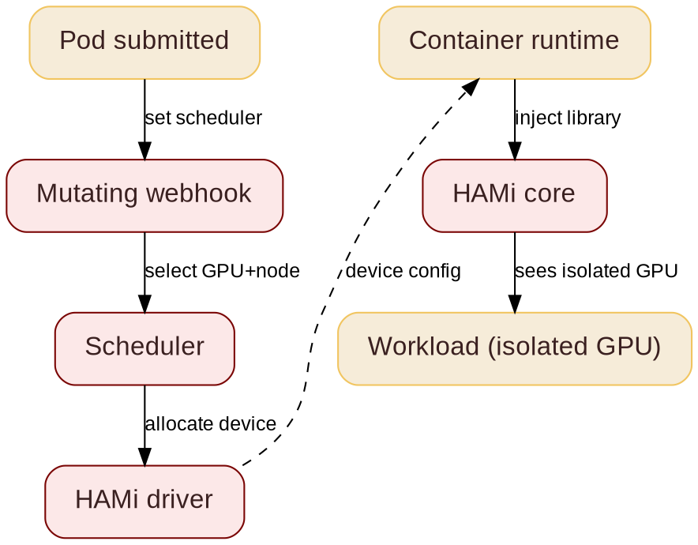

@variant dark
@kicker HITCON 2026
@side-image assets/qr-hami-repo.png
# DoS AI Workloads & Defensive MCP

@subtitle Architecture and Gotchas

@speaker name="Reza Jelveh" role="Solution Architect, Dynamia AI" github=github.com/fishman linkedin=linkedin.com/in/rezajelveh

---

# Part 1: The Problem

@subtitle One small pod can DoS the GPU

---

## A Small Model Can DoS the GPU

@subtitle No memory limit, no borders

<!--
Two ways a small pod breaks the GPU. One: no memory cap, a greedy pod allocates until the card is full and everyone else OOMs. Two, the subtler DoS: spamming small models fragments memory - a little free here, a little there, but no card has a big contiguous chunk, so large training jobs cannot be scheduled at all. Production traces show partial-GPU sharing can leave hundreds of GPUs unallocated. HAMi fixes both: hard per-pod memory and compute limits enforced at the CUDA API layer, and binpack placement that packs small slices tight and leaves whole cards free for big models.
-->

::: grid {cols=2}
::: card {tag=red}
### {icon:triangle-alert cls=accent-secondary} No limits: OOM

Small model, no cap, whole card. The first allocation that fails is never the greedy pod's: training killed, LLM evicted.
:::
::: card {tag=yellow}
### {icon:layers cls=accent-contrast} Fragmentation DoS

Spam small models across the cluster. A little memory here, a little there: every card fragments, big training jobs cannot fit.
:::
::: card {tag=green}
### {icon:shield-check cls=accent-primary} Fix: hard limits

Every allocation checked against the pod's slice. Memory and compute caps, enforced on every call.
:::
::: card {tag=cyan}
### {icon:git-branch cls=accent-contrast} Fix: binpack scheduling

Pack small slices onto the fewest cards. Whole cards stay free for big models.
:::
:::


---
# Part 2: The Solution

@subtitle Hard limits and smart scheduling close the DoS

---

@layout two-col

## GPU Sharing

@subtitle Dynamic fine-grained device slicing

<!--
Same YAML across vendors. Ascend example on the right. Memory is hard limit, cores are best-effort. This is what users actually write.
-->

- **NVIDIA, Ascend, Cambricon, Hygon, Iluvatar** supported
- **Fine-grained:** as small as 1MB device memory, 1% computing cores
- **Transparent to tasks:** no code changes required
- **Hard resource isolation** inside containers
- One API across vendors: same YAML, any accelerator

@col

```yaml
# Ascend 910C: 8GB + 20% compute
resources:
  limits:
    huawei.com/Ascend910C: "1"
    huawei.com/Ascend910C-core: "20"
    huawei.com/Ascend910C-memory: "8192"
```

```yaml
# NVIDIA: 3GB on any GPU
resources:
  limits:
    nvidia.com/gpu: 1
    nvidia.com/gpumem: 3000
```

---


@layout two-col

## CUDA Hijacking

@subtitle Your app does not change

<!--
HAMi ships a small library. The container runtime loads it before your app starts. It intercepts CUDA calls and replies with your slice. No code changes, no kernel modules, no driver changes.
-->

Your app calls CUDA. HAMi answers with a slice of the GPU.

- Small library loaded before your app (`LD_PRELOAD`)
- Intercepts CUDA calls, no app code changes
- No kernel modules, no driver changes
- Works for any framework: PyTorch, TensorFlow, vLLM

@col


---

@layout two-col

## How HAMi Works

@subtitle From pod submission to isolated GPU

<!--
Five stages from pod submission to isolated GPU. The mutating webhook routes the pod, the scheduler picks a device, the HAMi core library enforces isolation in the container.
-->

- **Mutating webhook:** sees GPU requests, routes pod to HAMi scheduler
- **Scheduler:** selects GPU and node
- **HAMi driver:** generates device config
- **Container runtime:** reads config, injects HAMi-Core library
- **HAMi core:** enforces isolation in-process

@col



---

## Isolation: Physical Fences vs Software Checks

@subtitle What the silicon does, what the library does, what leaks

<!--
MIG is the strongest widely-deployed GPU isolation: dedicated SMs, L2 partitions, memory slices. But it is not absolute. Research has broken MIG with an L2 cache side channel via memory barriers (USENIX Security 2026), a GPU TLB covert channel (CCS 2023), and uncore channels through NVENC/NVDEC/NVJPEG and DRAM frequency scaling (MICRO 2024), all without root. Software boundaries are weaker in principle: time-slicing has no memory isolation and residual GPU memory is readable by co-tenants. HAMi's boundary is a library that checks every allocation in-process. Weaker than silicon, but it is the only option for sub-MIG slicing and multi-vendor, and it runs exactly where the tenant code runs.
-->

::: grid {cols=2}
::: card {tag=green}
### {icon:shield cls=accent-primary} Physical limits: MIG

Dedicated SMs, L2 partitions, memory slices. Fenced in silicon: one instance crashing never touches another. The strongest boundary there is.
:::
::: card {tag=cyan}
### {icon:code cls=accent-contrast} Software-enforced: HAMi

Every CUDA allocation checked against the pod's slice, in-process. No silicon fence: the boundary is a library that intercepts the API.
:::
::: card {tag=yellow}
### {icon:bug cls=accent-secondary} Hardware fences leak

MIG has been broken by side channels: L2 cache timing across partitions, a GPU TLB covert channel, NVENC/NVDEC/JPEG uncore channels. No root needed.
:::
::: card {tag=red}
### {icon:shield-alert cls=accent-secondary} Software fences leak more

Time-slicing has no memory isolation: residual GPU memory is readable by co-tenants. A software boundary holds only as well as the interception.
:::
:::

**Isolation is a spectrum: pick the boundary that matches your threat model.**

---

## HAMi Capabilities

@subtitle Six things HAMi brings to GPU scheduling

<!--
Six capabilities. The key ones for this talk: hard isolation, advanced scheduling, and unified monitoring. Heterogeneous management is the differentiator -- not just NVIDIA.
-->

::: grid {cols=2}
::: card
### {icon:layers cls=accent-primary} Heterogeneous Management

Manage GPU, NPU, MLU, and other accelerators in one workflow.
:::
::: card
### {icon:shield-check cls=accent-primary} Hard Isolation

Slice memory and compute with hard isolation at runtime.
:::
::: card
### {icon:git-branch cls=accent-contrast} Advanced Scheduling

Binpack, spread, and topology-aware placement policies.
:::
::: card
### {icon:box cls=accent-primary} Kubernetes Native

Kubernetes-native APIs, DRA, and CDI support.
:::
::: card
### {icon:gauge cls=accent-primary} Resource Isolation & QoS

Memory and core quotas for fair, stable sharing.
:::
::: card
### {icon:chart-bar cls=accent-contrast} Unified Monitoring

Consistent metrics and visibility across vendors.
:::
:::
---

---

# Part 3: In Production

@subtitle Ecosystem

---

@layout ecosystem
## Community & Adopters

@subtitle Devices, integrations, and who uses HAMi

<!--
4.1k stars, 325k pulls, 500+ contributors, 27 countries. 11 device types, 20+ adopters. This is the ecosystem slide: show the breadth. The QR code links to github.com/Project-HAMi/HAMi.
-->

#### Open Source, CNCF Backed, Production Ready
::: grid {cols=5}
::: card {metric}
4.1k
Github Stars
:::
::: card {metric}
325k
Docker Pulls
:::
::: card {metric}
500+
Contributors
:::
::: card {metric}
27
Contributor Countries
:::
::: card

     
:::
:::

#### Ecosystem & Device Support
::: grid {cols=2}
::: card
    
   
 
:::
:::

#### Adopters
::: grid {cols=2}
::: card
    
    
    
    
:::
:::

---

# Part 4: After Thoughts

@subtitle MCP plugins vs. an integrated server

---

## MCP Plugins: Do Not Trust the Tool

@subtitle You do not know if it wipes your mail

<!--
OpenClaw deleted the Meta AI alignment director's entire mailbox: https://www.businessinsider.com/meta-ai-alignment-director-openclaw-email-deletion-2026-2. An MCP plugin hands an LLM full mail operations with no declared capabilities, so you hand-roll the harness: staging, sandboxing, review. The plugin itself has no boundary.
-->

::: grid {cols=2}
::: card {tag=red}
### {icon:trash-2 cls=accent-secondary} Unknown destructive power

- OpenClaw wiped the Meta AI director's whole mailbox
- Your MCP tool can do the same: you do not know
:::
::: card {tag=yellow}
### {icon:shield-alert cls=accent-contrast} You build the harness

- LLM tries to break your system
- You hand-roll guards: staging, sandboxing, review
:::
:::

**You can audit a plugin, but a defensive security posture is better.**

::: card
### {icon:shield-alert cls=accent-contrast} Experimental mail client with integrated MCP

github.com/fishman/notmutt

:::

---

@layout image-right

## Integrated MCP: Boundaries in the Client

@subtitle Whitelist tools, no file writes, staged destruction

<!--
notmutt integrates an MCP server (go-mcp) with a defensive posture: tools whitelisted via [mcp] allow (unknown names are startup errors), plugin VMs with no os/io/debug (no filesystem), staged destructive commands (stage, then APPLY; the buffer is the undo). Sandbox is part of the design, not an agent guardrail the LLM can ignore.
-->

- **Whitelist tools:** `[mcp] allow` names each tool; unknown names are startup errors
- **No filesystem writes:** plugin VMs have no os/io/debug libraries
- **Staged destructive commands:** stage, then APPLY. The buffer is the undo
- **Sandbox in the design,** not an agent guardrail

::: card {tag=red}
### {icon:hard-drive cls=accent-secondary} Same-disk caveat

- Agent on the same disk reads the maildir or mbox directly, no MCP needed
- Isolation is a property of the deployment, not the tool
:::


---

@kicker Thank You
@side-image assets/qr-notmutt.png
# Questions? Find me

@subtitle github.com/fishman

@speaker name="Reza Jelveh" role="Solution Architect, Dynamia AI" github=github.com/fishman linkedin=linkedin.com/in/rezajelveh
