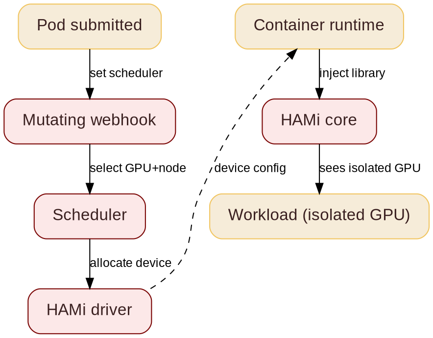

@variant dark
@kicker HITCON 2026
@side-image assets/coscup26/qr_code_coscup2026.png
# DoS AI Workloads & Defensive MCP

@subtitle Architecture and Gotchas

@speaker name="Reza Jelveh" role="Solution Architect, Dynamia AI" github=github.com/fishman linkedin=linkedin.com/in/rezajelveh

---

# Part 1: The Problem

@subtitle GPUs are expensive, and Kubernetes does not share them well

---

@layout image-right

## The Problem

@subtitle One GPU per task is the default

Kubernetes allocates GPUs atomically: one whole device, one task.

- A 1 GB task blocks an 80 GB device
- Most GPUs sit idle most of the time
- DRA (Dynamic Resource Allocation) is stable, but still work in progress
- No advanced scheduling yet: no binpack, no spread, no topology


---

## What is HAMi

@subtitle Before: one GPU, one task

<!--
GPUs are expensive and often underutilized. HAMi is a heterogeneous GPU sharing framework for Kubernetes. It slices GPUs and shares them across workloads, without rewriting your stack.
-->


---

## What is HAMi
@transition none

@subtitle After: one GPU, many tasks


---

# Part 2: The Solution

@subtitle No code changes. No kernel modules. No vendor lock-in.

---

@layout two-col

## GPU Sharing

@subtitle Dynamic fine-grained device slicing

<!--
Same YAML across vendors. Ascend example on the right. Memory is hard limit, cores are best-effort. This is what users actually write.
-->

- **NVIDIA, Ascend, Cambricon, Hygon, Iluvatar** supported
- **Fine-grained:** as small as 1MB device memory, 1% computing cores
- **Transparent to tasks:** no code changes required
- **Hard resource isolation** inside containers
- One API across vendors: same YAML, any accelerator

@col

```yaml
# Ascend 910C: 8GB + 20% compute
resources:
  limits:
    huawei.com/Ascend910C: "1"
    huawei.com/Ascend910C-core: "20"
    huawei.com/Ascend910C-memory: "8192"
```

```yaml
# NVIDIA: 3GB on any GPU
resources:
  limits:
    nvidia.com/gpu: 1
    nvidia.com/gpumem: 3000
```

---

@layout two-col

## How HAMi Works

@subtitle From pod submission to isolated GPU

<!--
Five stages from pod submission to isolated GPU. The mutating webhook routes the pod, the scheduler picks a device, the HAMi core library enforces isolation in the container.
-->

- **Mutating webhook:** sees GPU requests, routes pod to HAMi scheduler
- **Scheduler:** selects GPU and node
- **HAMi driver:** generates device config
- **Container runtime:** reads config, injects HAMi-Core library
- **HAMi core:** enforces isolation in-process

@col



---

@layout two-col

## The Magic: CUDA Hijacking

@subtitle Your app does not change

<!--
HAMi ships a small library. The container runtime loads it before your app starts. It intercepts CUDA calls and replies with your slice. No code changes, no kernel modules, no driver changes.
-->

Your app calls CUDA. HAMi answers with a slice of the GPU.

- Small library loaded before your app (`LD_PRELOAD`)
- Intercepts CUDA calls, no app code changes
- No kernel modules, no driver changes
- Works for any framework: PyTorch, TensorFlow, vLLM

@col


---

## Why Memory Isolation Matters

@subtitle One bad task must not kill its neighbors

<!--
Without isolation, one workload can grab all memory and OOM-kill the other tasks on the same GPU. HAMi enforces memory when it hijacks the CUDA API calls: every task sees only its own slice.
-->

::: grid {cols=2}
::: card {tag=red}
### {icon:triangle-alert cls=accent-secondary} Without HAMi

Tasks share a GPU with no borders. One greedy task eats all memory and kills the neighbors. Multi-tenant means risky.
:::
::: card {tag=green}
### {icon:shield-check cls=accent-primary} With HAMi

Each task sees only its slice. Memory is a hard limit, enforced by the hijacked CUDA calls: every allocation is checked against your slice.
:::
::: card {tag=yellow}
### {icon:refresh-cw cls=accent-contrast} Oversubscription

Idle memory can be swapped to host RAM, so more models fit. Great for inference, not for active training.
:::
::: card {tag=cyan}
### {icon:gauge cls=accent-contrast} Per-task limits

```yaml
resources:
  limits:
    nvidia.com/gpu: 1
    nvidia.com/gpumem: 3000
```
3 GB slice on any GPU. Same YAML works for Ascend, Cambricon and more.
:::
:::

---

## GPU Sharing Approaches

@subtitle MIG vs HAMi vs NVIDIA DRA

<!--
Common question: why not just use MIG? MIG does not work on all devices and needs manual templates. NVIDIA DRA supports MIG, MPS and VFIO, but has no advanced scheduling. HAMi adds symbolic hijacking for sub-MIG slicing and multi-vendor support.
-->

| Capability | MIG | HAMi | NVIDIA DRA |
|------------|:---:|:---:|:---:|
| Sub-MIG slicing | {icon:x cls=accent-secondary} | {icon:check cls=accent-primary} | {icon:x cls=accent-secondary} |
| Dynamic repartition | {icon:x cls=accent-secondary} | {icon:check cls=accent-primary} | {icon:check cls=accent-primary} |
| Multi-vendor | {icon:x cls=accent-secondary} | {icon:check cls=accent-primary} | {icon:x cls=accent-secondary} |
| Advanced scheduling | {icon:x cls=accent-secondary} | {icon:check cls=accent-primary} | {icon:x cls=accent-secondary} |
| No code changes | {icon:x cls=accent-secondary} | {icon:check cls=accent-primary} | {icon:x cls=accent-secondary} |

HAMi differentiates with symbolic hijacking (1 MiB granularity on NVIDIA), consumable capacities for flexible requests, and multi-vendor support. HAMi-DRA builds on NVIDIA's upstream DRA driver and supports multiple DRA drivers.

---

## HAMi Capabilities

@subtitle Six things HAMi brings to GPU scheduling

<!--
Six capabilities. The key ones for this talk: hard isolation, advanced scheduling, and unified monitoring. Heterogeneous management is the differentiator -- not just NVIDIA.
-->

::: grid {cols=2}
::: card
### {icon:layers cls=accent-primary} Heterogeneous Management

Manage GPU, NPU, MLU, and other accelerators in one workflow.
:::
::: card
### {icon:shield-check cls=accent-primary} Hard Isolation

Slice memory and compute with hard isolation at runtime.
:::
::: card
### {icon:git-branch cls=accent-contrast} Advanced Scheduling

Binpack, spread, and topology-aware placement policies.
:::
::: card
### {icon:box cls=accent-primary} Kubernetes Native

Kubernetes-native APIs, DRA, and CDI support.
:::
::: card
### {icon:gauge cls=accent-primary} Resource Isolation & QoS

Memory and core quotas for fair, stable sharing.
:::
::: card
### {icon:chart-bar cls=accent-contrast} Unified Monitoring

Consistent metrics and visibility across vendors.
:::
:::
---

@layout image-right

## Scheduling Policies

@subtitle Topology-Aware

<!--
NVLink vs PCIe is a 7-14x bandwidth gap. HAMi schedules multi-GPU workloads to NVLink-connected pairs, avoids PCIe bridge pairs. Ascend uses HCCS, other vendors have their own high-speed interconnects: same topology logic applies. This matters for tensor parallelism and large-model training.
-->


- **NVLink 3 (A100):** 600 GB/s, 12 links
- **NVLink 4 (H100/H200):** 900 GB/s bidirectional across 18 links
- **NVLink 5 (B200/B300):** 1.8 TB/s, 14x PCIe 5.0
- **NVLink 6 (Rubin):** ~3.6 TB/s target
- **PCIe 5.0 x16:** 128 GB/s. **PCIe 6.0:** 242 GB/s
- **HAMi topology policy:** prefers NVLink (NVIDIA), HCCS (Ascend), and other high-speed interconnects, avoids PCIe bridge pairs

---

@layout ecosystem
## Community & Adopters

@subtitle Devices, integrations, and who uses HAMi

<!--
4.1k stars, 325k pulls, 500+ contributors, 27 countries. 11 device types, 20+ adopters. This is the ecosystem slide: show the breadth. The QR code links to github.com/Project-HAMi/HAMi.
-->

#### Open Source, CNCF Backed, Production Ready
::: grid {cols=5}
::: card {metric}
4.1k
Github Stars
:::
::: card {metric}
325k
Docker Pulls
:::
::: card {metric}
500+
Contributors
:::
::: card {metric}
27
Contributor Countries
:::
::: card

     
:::
:::

#### Ecosystem & Device Support
::: grid {cols=2}
::: card
    
   
 
:::
:::

#### Adopters
::: grid {cols=2}
::: card
    
    
    
    
:::
:::

---

@kicker Thank You
@side-image assets/coscup26/qr_code_coscup2026.png
# Questions? Try HAMi

@subtitle github.com/Project-HAMi/HAMi

@speaker name="Reza Jelveh" role="Solution Architect, Dynamia AI" github=github.com/fishman linkedin=linkedin.com/in/rezajelveh
