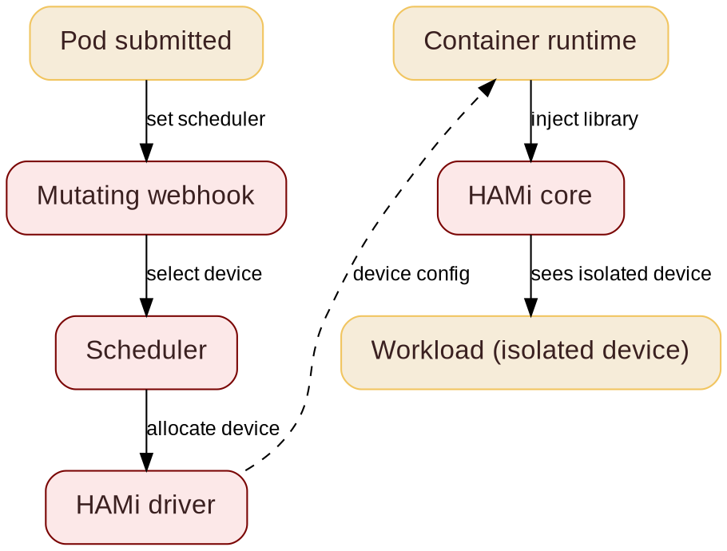

@variant dark
@kicker Open Source Summit Korea 2026  -  Embedded & Open AI
# Simplifying AI for Edge Compute with HAMi

@subtitle Slicing one device, running many agents

@speaker name="Reza Jelveh" role="Solution Architect, Dynamia AI  -  Makers of HAMi" github=github.com/fishman linkedin=linkedin.com/in/rezajelveh

---

# Part 1: The Problem

@subtitle The model is not the hard part, the compute is

---

## Edge Agents, Starved Compute

@subtitle Open-source agents need edge hardware

<!--
Hermes and OpenClaw can reason and use tools. Running them at the edge is hard: not because of the models, but because of the compute underneath. Limited memory, tight power budgets, no ops team. Democratizing agentic AI means fixing the compute layer.
-->

Open-source agents like Hermes and OpenClaw can reason and use tools. Edge deployment is still hard: not the model, the compute underneath.

::: grid {cols=3}
::: card {tag=red}
### {icon:memory-stick cls=accent-secondary} Limited memory

A Jetson-class device has 8-64 GB of unified memory, shared with the OS. One agent stack can eat it all.
:::
::: card {tag=yellow}
### {icon:zap cls=accent-contrast} Tight power budgets

No 300 W data-center GPU at the edge. You get 5-40 W, often battery or solar.
:::
::: card {tag=cyan}
### {icon:user-x cls=accent-primary} No ops team

No GPU cluster admin, no Prometheus dashboards. It has to work after setup, unattended.
:::
:::

Democratizing agentic AI means fixing the compute layer.

---

## Not All Edge Compute Is Agents

@subtitle Most edge inference today is CV and classic ML

<!--
Most inference running on edge devices today is not language models. YOLO-style detection, classification, OCR, embeddings: small models, millisecond latency, already cheap on NPUs and embedded GPUs. Agents are a new slice and the hardest one to schedule: memory-heavy LLMs running concurrently on the same device.
-->

Most edge inference is CV and classic ML, not LLMs. Agents are the new slice.

::: grid {cols=3}
::: card {tag=green}
### {icon:scan cls=accent-secondary} CV and classic inference

- YOLO, classification, OCR, embeddings
- 1-50M params, millisecond latency
- Runs on NPUs and embedded GPUs today
:::
::: card {tag=cyan}
### {icon:message-square cls=accent-primary} LLMs

- Autoregressive text generation
- Weights plus KV cache in memory
- Needs GPU-class silicon
:::
::: card {tag=red}
### {icon:bot cls=accent-secondary} Agents

- LLMs in a tool-use loop
- Several concurrent per device
- Memory-hungry, latency-tolerant
:::
:::

One deployment pattern for all three: same device sharing for small-model inference and agent tasks.

---

## What is HAMi

@subtitle Before: one device, one task

<!--
GPUs are expensive and often underutilized. HAMi is a heterogeneous GPU sharing framework for Kubernetes. It slices GPUs and shares them across workloads, without rewriting your stack.
-->


---

## What is HAMi
@transition none

@subtitle After: one device, many agents


---

@layout compare

## The Edge Compute Challenge

@subtitle What breaks, what HAMi needs to solve

::: card {tag=compare}
### Problem

- One model per device, most of it idle
- Fixed memory budgets: install once, never share
- Vendors locked in: Jetson CUDA vs NPU SDKs
- No central observability
- Fault isolation: one bad agent kills the device
:::

::: arrow

{icon:arrow-right cls=accent-primary size=48}
:::

::: card {tag=compare}
### Requirements

- Hardware agnostic: one API, any accelerator
- Carve one device's memory into fine-grained slices
- Time-sharing when demand exceeds memory
- Advanced scheduling: binpack, spread
- Open source, no vendor lock-in
:::

<!--
The real work is memory isolation: carving unified memory so multiple agents run concurrently, and time-sharing when demand exceeds it.
-->

---

# Part 2: The Solution

@subtitle One scheduling plane across heterogeneous accelerators

---

@layout two-col

## Carving Unified Memory

@subtitle Slices of one device, not whole devices

<!--
Jetson-class devices share one LPDDR pool between CPU and GPU. HAMi carves it: each agent requests MiB of memory and percent of compute, and sees only its slice. When demand exceeds memory, idle slices swap to host RAM: time-sharing. Same YAML as the data center, on hardware as small as a Jetson.
-->

- **Unified memory is carveable:** CPU and GPU share one LPDDR pool
- **Fine-grained:** MiB-level slices, multiple agents per device
- **Time-sharing:** when demand exceeds memory, idle slices swap to host RAM
- **Hard limits per agent:** one task cannot eat its neighbors
- **Same YAML in the data center and at the edge**

@col

```yaml
# Two agents on one Jetson, 4 GB and 40% compute each
resources:
  limits:
    nvidia.com/gpu: 1
    nvidia.com/gpumem: 4096
    nvidia.com/gpucores: 40
```

```yaml
# Third agent, time-shared
resources:
  limits:
    nvidia.com/gpu: 1
    nvidia.com/gpumem: 2048
    nvidia.com/gpucores: 20
```

---

## Why Jetson Has No MIG

@subtitle Hardware partitioning is a data-center feature

<!--
MIG is not a software feature. It needs dedicated partitioning logic in the silicon, present in data-center GPUs like A100 and H100. NVIDIA engineers confirmed: the Orin's embedded Ampere die does not have the hardware support, and MIG was never enabled in JetPack for Orin. JetPack 7.0 adds MIG only on Jetson Thor T5000, and only as a technology preview. Software slicing is the only path on Jetson.
-->

::: grid {cols=3}
::: card {tag=red}
### {icon:cpu cls=accent-secondary} No hardware support

MIG needs partitioning logic in the silicon. Data-center GPUs (A100, H100) have it. Orin's embedded Ampere die does not.
:::
::: card {tag=yellow}
### {icon:box cls=accent-contrast} Never enabled in JetPack

MIG has never been enabled for Orin. JetPack 7.0 adds it only on Jetson Thor T5000, as a technology preview.
:::
::: card {tag=cyan}
### {icon:layers cls=accent-primary} CUDA context cap

Orin is capped at ~32 concurrent CUDA contexts. Software slicing is the only path to many tenants.
:::
:::

**MIG on Jetson: not a software toggle. The hardware is not there.**

---

## Small Models Do Not Need MIG

@subtitle Edge agents fit in slices, not fixed hardware partitions

<!--
The agents we want at the edge run small models: Llama-3.2-1B and 3B, Qwen2.5-0.5B through 3B, Hermes-3-3B. A few GB of weights plus context. MIG's smallest A100 slice is 1g.5gb: a fixed 5 GB partition. On an 8 GB Jetson, one MIG-class partition would leave almost nothing else. MiB-granular software slicing fits 10+ small agents where MIG could not fit a single fixed partition.
-->

::: grid {cols=2}
::: card {tag=green}
### {icon:bot cls=accent-primary} Edge agents run small models

Llama-3.2-1B/3B, Qwen2.5-0.5B to 3B, Hermes-3-3B: 1-8 GB with context. They fit in slices, not partitions.
:::
::: card {tag=red}
### {icon:layers cls=accent-secondary} MIG profiles are coarse

Smallest A100 slice is 1g.5gb: a fixed 5 GB partition. No dynamic repartition, no sub-slicing.
:::
::: card {tag=cyan}
### {icon:gauge cls=accent-primary} Granularity mismatch

On an 8 GB Jetson, one fixed 5 GB partition leaves nothing for anything else. MiB slices fit 10+ agents.
:::
::: card {tag=yellow}
### {icon:refresh-cw cls=accent-contrast} Dynamic, not static

MIG partitions are fixed at boot. Edge demand changes: agents come and go. Software slicing repartitions live.
:::
:::

**MIG solves a data-center problem with fixed profiles. The edge needs dynamic, fine-grained carving.**

---

## Jetson vs NPUs: DeepX, Axelera and Furiosa

@subtitle Different partitioning, different schedulability

<!--
DeepX and Furiosa are Korean, both based in Seongnam. DX-M1: 25 TOPS at 1-5 W on an M.2 card, 4 GB LPDDR5 on the module. Axelera is Dutch (Eindhoven): Metis AIPU, RISC-V with digital in-memory computing, ~214 TOPS at 3.5-15 W. Furiosa RNGD: datacenter NPU, 512 TOPS INT8 at 180 W, 48 GB HBM3, PCIe Gen5. Jetson is self-contained with unified memory; the NPUs are PCIe add-ons with memory on the card. Only RNGD has hardware partitioning (SR-IOV, fixed 6/12/24/48 GB); the rest share nothing at the hardware level, so scheduling them means accounting for on-card capacity, not carving host memory.

If someone asks why Metis wins on per-watt: moving data costs far more energy than doing the math. Axelera's chip computes inside its own memory, so the weights never travel. That only works while the model fits in the chip's small on-chip memory. Big models need big HBM memory, and then every chip pays the data-movement tax. That is why RNGD and every LLM chip lands at a few TOPS/W: not a flaw in RNGD, it is the physics of large models.
-->

| | Jetson AGX Orin | DeepX DX-M1 | Axelera Metis | Furiosa RNGD |
|---|---|---|---|---|
| Architecture | CUDA GPU, unified memory | Proprietary NPU | RISC-V + in-memory compute | TCP NPU, 8 PEs |
| Peak compute (INT8) | 275 TOPS (sparse) | 25 TOPS | ~214 TOPS | 512 TOPS |
| Power | 15-60 W configurable | 1-5 W | 3.5-15 W | 180 W |
| Perf/watt | 1x baseline | ~20x vs GPGPU (vendor) | ~15 TOPS/W | ~2.8 TOPS/W |
| Memory | 64 GB unified LPDDR5 | 4 GB LPDDR5 on card | 16 MB L1 + 32 MB L2 SRAM, 4-16 GB DDR | 48 GB HBM3 |
| Partitioning | None | None | Static 25% L2 per core (1-4) | SR-IOV fixed: 6/12/24/48 GB |

*RNGD is datacenter class, not edge: 180 W is low for that class (NVIDIA runs 400-1000 W). Value here: Korean domestic silicon, air-cooled density, and the only hardware partitioning in the table. Its edge sibling Warboy (64 TOPS) has none.*

---

## Making NPUs Schedulable

@subtitle What it takes to share them

<!--
Three pieces are needed. Capacity reporting: tell the scheduler what each device has, in memory MiB and compute percent. Allocation: decide which slice goes where, binpack or spread. Enforcement: the hard part. On CUDA, HAMi hijacks the runtime calls. NPU SDKs are closed compilers: there is no hijack point, so enforcement has to happen in the SDK's runtime or stay scheduler-side. The DRA path solves this cleanly: typed capacities in ResourceSlices, allocation decided by the scheduler, no code changes. Status today: HAMi supports NVIDIA, Ascend, Cambricon, Hygon, Iluvatar and more; Jetson and these NPUs are not supported yet. This is the roadmap, honestly stated.
-->

- **Capacity reporting:** publish memory MiB and compute % per device
- **Allocation:** binpack and spread policies fit agents into the gaps
- **Enforcement: the hard part.** CUDA has a hijack point (the runtime library). NPU SDKs are closed compilers: no hijack, so limits live in the SDK runtime or scheduler-side
- **The clean path is DRA:** typed capacities in ResourceSlices, scheduler allocates, no code changes
- **Honest status:** HAMi shares NVIDIA, Ascend, Cambricon, Hygon, Iluvatar today. Jetson and these NPUs are the frontier, not a shipped feature

---

@layout image-left
## DRA: ResourceSlice

@subtitle Per-node device inventory

<!--
DRA drivers run on each node and publish available devices. The scheduler reads ResourceSlices to find nodes that can satisfy a claim. This is how the scheduler knows what hardware is free.
-->


- **ResourceSlice:** lists all available devices on a node with their attributes
- DRA drivers publish slices; scheduler reads them to match claims to devices
- Tied to a node via `nodeName`, supports topology and NUMA attributes

---

@layout image-right

## DRA: ResourceClaim

@subtitle A standardized way to request hardware: not just GPUs. Stable in K8s 1.34.

<!--
DeviceClass defines a category of devices by capability. ResourceClaim requests specific hardware from that category. ResourceClaimTemplate creates a claim per pod automatically. Together these replace the old device plugin model.
-->


- **DeviceClass:** groups devices with identical resource models. **ResourceClaim:** a workload's ticket to hardware. **ResourceClaimTemplate:** reusable blueprint, auto-creates a claim per Pod.

---

@layout two-col

## How HAMi Works

@subtitle From pod submission to isolated device

<!--
Five stages from pod submission to isolated GPU. The mutating webhook routes the pod, the scheduler picks a device, the HAMi core library enforces isolation in the container.
-->

- **Mutating webhook:** sees accelerator requests, routes pod to HAMi scheduler
- **Scheduler:** selects device and node
- **HAMi driver:** generates device config
- **Container runtime:** reads config, injects HAMi-Core library
- **HAMi core:** enforces isolation in-process

@col



---

@layout two-col

## The Magic: Runtime Hijacking

@subtitle Your app does not change

<!--
HAMi ships a small library. The container runtime loads it before your app starts. On NVIDIA it intercepts CUDA calls and replies with your slice. Same pattern for other vendors: ACL calls on Ascend, CNRT on Cambricon. No code changes, no kernel modules, no driver changes. On closed NPU SDKs there is no hijack point: that is the enforcement gap.
-->

Your app calls CUDA. HAMi answers with a slice of the device.

- Small library loaded before your app (`LD_PRELOAD`)
- Intercepts CUDA calls, no app code changes
- No kernel modules, no driver changes
- Same pattern per vendor: ACL on Ascend, CNRT on Cambricon

@col


---

## Why Memory Isolation Matters

@subtitle One bad agent must not kill its neighbors

<!--
Without isolation, one workload can grab all memory and OOM-kill the other tasks on the same device. HAMi enforces memory when it hijacks the runtime calls: every task sees only its own slice.
-->

::: grid {cols=2}
::: card {tag=red}
### {icon:triangle-alert cls=accent-secondary} Without HAMi

Tasks share a device with no borders. One greedy agent eats all memory and kills the neighbors. On a 8 GB Jetson, that is the whole device.
:::
::: card {tag=green}
### {icon:shield-check cls=accent-primary} With HAMi

Each task sees only its slice. Memory is a hard limit, enforced by the hijacked runtime calls: every allocation is checked against your slice.
:::
::: card {tag=yellow}
### {icon:refresh-cw cls=accent-contrast} Time-sharing

Idle memory can be swapped to host RAM, so more agents fit. Great for inference, not for active training.
:::
::: card {tag=cyan}
### {icon:gauge cls=accent-contrast} Per-task limits

```yaml
resources:
  limits:
    nvidia.com/gpu: 1
    nvidia.com/gpumem: 3000
```
3 GB slice on any device. Same YAML works for Ascend, Cambricon and more.
:::
:::

---

## Consumable Capacities

@subtitle Device resources as a pool you draw from

<!--
Device resources are consumable: memory in MiB, compute in % of the device's compute units. The scheduler tracks remaining capacity per device and packs by it. HAMi-core enforces the ceiling on hijacked calls; nvidia-smi inside the pod shows your slice, not the card. Since v2.8 the same semantics exist on the DRA path (ResourceSlice typed capacities, ResourceClaims).
-->

::: grid {cols=2}
::: card {tag=cyan}
### {icon:gauge cls=accent-primary} Memory and compute, separate axes

Request MiB of memory and percent of compute units. What you use is what you get, no fixed profiles.
:::
::: card {tag=green}
### {icon:layers cls=accent-primary} Scheduler packs by remaining capacity

Every device reports memory and compute left. Binpack and spread policies fit requests into the gaps.
:::
::: card {tag=yellow}
### {icon:shield-check cls=accent-contrast} Enforced on hijacked calls

HAMi-core caps every allocation at your slice. Inside the pod, nvidia-smi shows 0 MiB / 4000 MiB.
:::
::: card {tag=red}
### {icon:git-branch cls=accent-contrast} Same semantics on DRA (v2.8+)

Typed ResourceSlice capacities (memory step 1 MiB, cores 0-100). Requests become ResourceClaims.
:::
:::

---

## Types of Slicing

@subtitle Four ways to share one device

<!--
Slicing comes in four flavors. Memory and compute slicing are the core of HAMi: 1 MiB memory, 1% compute. Time slicing is pure software: no vendor ships a time-quantum API, the scheduler rotates compute access over time. So even if a vendor exposes no slicing at all, you can hook its driver SDK and build your own. That is reverse engineering: fragile, breaks on SDK updates. Better to ask the vendor for support, the way HAMi does with NVIDIA and Huawei.
-->

::: grid {cols=2}
::: card {tag=green}
### {icon:memory-stick cls=accent-secondary} Memory slicing

- Carve device memory per tenant
- HAMi: 1 MiB, dynamic per pod
- Native options are fixed partitions (MIG, vXPU buckets)
:::
::: card {tag=cyan}
### {icon:gauge cls=accent-secondary} Compute slicing

- Percent of compute units per tenant
- Core quotas: MPS %, dcucores, vcore
- Hard limit enforced on every call
:::
::: card {tag=yellow}
### {icon:clock cls=accent-contrast} Time slicing

- Rotate compute access over time
- Pure software: no vendor ships a time-quantum API
- Preemption optional: without it, long kernels run to completion
:::
::: card {tag=red}
### {icon:layers cls=accent-primary} Hardware partitioning

- MIG, SR-IOV, vXPU, vDCU
- Static, hardware-enforced
- Strongest isolation, least flexible
:::
:::

**Time slicing is pure software.** Even if a vendor exposes no slicing at all, you can hook its driver SDK and build your own. Reverse engineering is fragile: ask the vendor for support instead.

---

@layout image-right

## Scheduling Policies

@subtitle Binpack & Spread

<!--
Two axes, four patterns. Node binpack saves money, node spread saves uptime. GPU binpack saves whole devices, GPU spread saves tail latency. Pick based on workload: agents want binpack, latency-sensitive serving wants spread.
-->


- **Node binpack** frees whole machines: fewer active nodes, less power
- **Node spread** isolates faults: HA across a device fleet
- **GPU binpack** packs many agents onto one device
- **GPU spread** protects tail latency: one agent per device
- Advanced scheduling works with standalone HAMi; DRA mode can use Yunikorn

---

@layout two-col

## GPU Binpack

@subtitle Fill one device, run many agents

<!--
GPU binpack puts several agents on the same device. Each gets its own slice of memory and compute. This matters most when devices are scarce: on an 8 GB Jetson, four small agents fit where one would have.
-->

- Several agents share one device, each with its own slice of memory and compute
- Prevents fragmentation: scattered small workloads no longer block whole devices
- Frees whole devices for the job that cannot share
- Best for: fleets of small workloads - agent endpoints, batch jobs, dev and test

@col


---

@layout two-col

## GPU Spread

@subtitle One agent per device, no shared bottlenecks

<!--
GPU spread puts each agent on its own device. No tenant shares compute or memory bandwidth with another. If one agent thrashes its device, the neighbors do not feel it. Use it for latency-sensitive serving.
-->

- One agent per device: compute and memory bandwidth are never shared
- Isolates noisy neighbors: a thrasher on one device does not slow the others
- Protects tail latency: no cross-tenant contention
- Best for: latency-sensitive serving with strict SLOs

@col


---

# Part 3: Blueprint

@subtitle Edge AI without a cloud budget

---

## The Blueprint

@subtitle Three steps to a multi-agent edge device

<!--
The path is short. Pick a device: Jetson-class for CUDA compatibility (the HAMi slicing path exists for CUDA). NPUs like DeepX and Axelera have no runtime hook, so HAMi cannot slice them yet: they are the frontier, not today's choice. Slice it: memory in MiB, compute in percent, hard limits per agent. Schedule agents: binpack to pack them tight, spread for SLOs. Everything runs on k3s or k0s, managed with Kubernetes APIs, no ops team needed. Olares is the turnkey path: an open-source, k3s-based personal cloud OS that ships this stack pre-installed, with MCP and GPU scheduling built in, so agents run as standard containers on hardware you own.
-->

::: grid {cols=3}
::: card {tag=green}
### {icon:cpu cls=accent-primary} 1. Pick a device

Jetson-class GPU: CUDA compatibility, the HAMi slicing path. NPUs (DeepX, Axelera) are the frontier: no SDK hook, no slicing today.
:::
::: card {tag=cyan}
### {icon:gauge cls=accent-primary} 2. Slice it

Carve memory and compute into per-agent slices. Hard limits, live repartition, time-sharing when demand exceeds memory.
:::
::: card {tag=yellow}
### {icon:git-branch cls=accent-contrast} 3. Schedule agents

Binpack to pack many agents onto one device. Spread for latency-sensitive serving. Node spread across a device fleet for HA.
:::
:::

- **Deploy on Olares** ([github.com/beclab/olares](https://github.com/beclab/olares)): a k3s-based personal cloud OS that ships this stack pre-installed - agents as containers, MCP built in, local GPU scheduling
- Runs on k3s or k0s directly: Kubernetes APIs without the ops team
- One scheduling plane across heterogeneous accelerators
- Open source: HAMi is a CNCF Incubation project

---

@layout metrics
## Where HAMi Is Today

@subtitle Production metrics from CNCF case studies

::: grid {cols=4}
::: card {metric}
100%
Hardware pool utilization
Baike Holdings
:::
::: card {metric}
10x
GPU utilization in CI
NIO
:::
::: card {metric}
30%
Fewer GPU hours
China Merchants Bank
:::
::: card {metric}
10,000+
Pods running concurrently
Baike Holdings
:::
:::

@row

::: notes{ tag="green" }
China Merchants Bank - SNOW Corp. - NIO - KE Holdings - DaoCloud - SF Technology - Prep Education - [cncf.io/case-studies](https://www.cncf.io/case-studies/)
:::

---

@layout ecosystem
## Community & Adopters

@subtitle Devices, integrations, and who uses HAMi

<!--
4.1k stars, 325k pulls, 500+ contributors, 27 countries. 11 device types, 20+ adopters. This is the ecosystem slide: show the breadth. The QR code links to github.com/Project-HAMi/HAMi.
-->

#### Open Source, CNCF Backed, Production Ready
::: grid {cols=5}
::: card {metric}
4.1k
Github Stars
:::
::: card {metric}
325k
Docker Pulls
:::
::: card {metric}
500+
Contributors
:::
::: card {metric}
27
Contributor Countries
:::
::: card

     
:::
:::

#### Ecosystem & Device Support
::: grid {cols=2}
::: card
    
   
 
:::
:::

#### Adopters
::: grid {cols=2}
::: card
    
    
    
    
:::
:::

---

@kicker Thank You
# Questions? Try HAMi

@subtitle github.com/Project-HAMi/HAMi

@speaker name="Reza Jelveh" role="Solution Architect, Dynamia AI  -  Makers of HAMi" github=github.com/fishman linkedin=linkedin.com/in/rezajelveh
