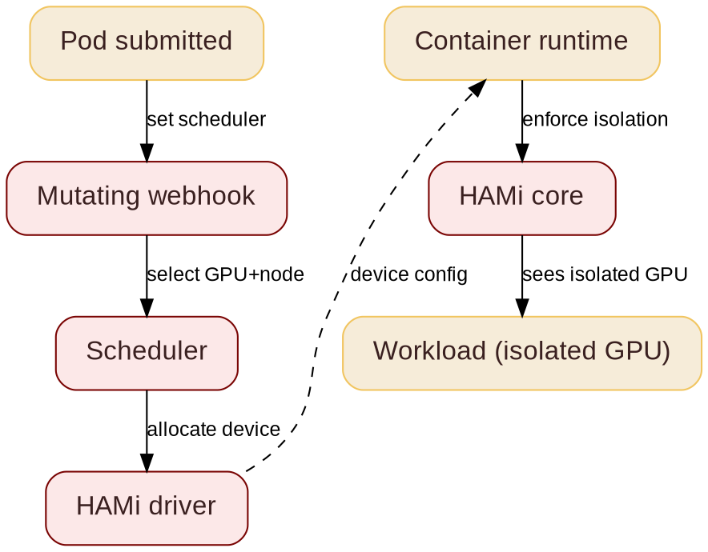

@kicker HAMi - A CNCF Incubation Project
@side-image assets/snow/kubecon-jp-qr.png
# Shared GPU Scheduling & Proactive Autoscaling

@subtitle A Production Blueprint for 1000+ GPUs

@speaker name="Jeonghyun Kim" role="AI Engineer, SNOW Corp." github=github.com/jeonghyunkeem linkedin=linkedin.com/in/jeonghyun-kim-2399a6203
@speaker name="Reza Jelveh" role="GTM & Solution Architecture @ Dynamia AI  -  Makers of HAMi" github=github.com/rezajelveh linkedin=linkedin.com/in/rezajelveh

---

# Part 1: The Problem

@subtitle GPU underutilization, atomic allocation, multi-tenant contention

---

@layout image-right

## The Problem

@subtitle Atomic GPU allocation wastes silicon

Kubernetes allocates GPUs atomically. DRA + HAMi fix this.

- 1 GB task blocks an 80 GB device
- Over-provisioning is the default: idle silicon
- DRA can request GPUs but requires MIG to slice
- Why HAMi if DRA slices? Covered in Part 2


---

## What is HAMi

@subtitle Static allocation, one GPU per task

<!--
GPUs are expensive and often underutilized. HAMi is a heterogeneous GPU sharing framework for Kubernetes. It lets you slice and share GPUs across workloads, maximizing utilization without rewriting your entire stack.
-->


---

## What is HAMi
@transition none

@subtitle Fractional vGPUs, multiple tasks per device


---

@layout compare

## The GPU Challenge

@subtitle What breaks, what HAMi needs to solve

::: card {tag=compare}
### Problem

- GPUs are scarce, allocated whole
- Vendors locked in, supply tight
- Utilization stuck at 10%
- No central observability
- Fragmented inference workloads
:::

::: arrow

{icon:arrow-right cls=accent-primary size=48}
:::

::: card {tag=compare}
### Requirements

- Hardware agnostic: one API, any accelerator
- Fractional GPU: fine-grained slices, multiple tasks per device
- Advanced scheduling: binpack, spread, topology-aware
- Unified observability across vendors
:::

<!--
Heterogeneous GPU sharing means you can run NVIDIA A100s, H100s, Ascend or other devices on the same cluster without manual partitioning. HAMi handles the scheduling logic. The real work is memory isolation.
-->

::: notes{ tag="green" }
Unified observability, 50% GPU utilization, 10x workloads running, 10x GPU availability. AMD MI355X: 80% of B200 perf at ~1/3 the cost. Not everyone needs Vera Rubin.
:::

---

# Part 2: The Solution

@subtitle Fractional GPU allocation and scheduling

---

## DRA Feature Timeline

@subtitle KEPs and their development status: not covered today

<!--
Backup slide. Shows all DRA KEPs and their dev status. Mention that DRA is moving fast -- 1.34 stable. We will skip this but it is here for questions.
-->


---

@layout image-right

## DRA: ResourceSlice

@subtitle Per-node device inventory

<!--
DRA drivers run on each node and publish available devices. The scheduler reads ResourceSlices to find nodes that can satisfy a claim. This is how the scheduler knows what hardware is free.
-->


- **ResourceSlice:** lists all available devices on a node with their attributes
- DRA drivers publish slices; scheduler reads them to match claims to devices
- Tied to a node via `nodeName`, supports topology and NUMA attributes

---

@layout image-right

## DRA: ResourceClaim

@subtitle A standardized way to request hardware: not just GPUs. Stable in K8s 1.34.

<!--
DeviceClass defines a category of devices by capability. ResourceClaim requests specific hardware from that category. ResourceClaimTemplate creates a claim per pod automatically. Together these replace the old device plugin model.
-->


- **DeviceClass:** groups devices with identical resource models. **ResourceClaim:** a workload's ticket to hardware. **ResourceClaimTemplate:** reusable blueprint, auto-creates a claim per Pod.

---

## HAMi Capabilities

@subtitle Six things HAMi brings to GPU scheduling

<!--
Six capabilities. The key ones for this talk: hard isolation, advanced scheduling, and unified monitoring. Heterogeneous management is the differentiator -- not just NVIDIA.
-->

::: grid {cols=2}
::: card
### {icon:layers cls=accent-primary} Heterogeneous Management

Manage GPU, NPU, MLU, and other accelerators in one workflow.
:::
::: card
### {icon:shield-check cls=accent-primary} Hard Isolation

Slice memory and compute with hard isolation at runtime.
:::
::: card
### {icon:git-branch cls=accent-contrast} Advanced Scheduling

Binpack, spread, and topology-aware placement policies.
:::
::: card
### {icon:box cls=accent-primary} Kubernetes Native

Kubernetes-native APIs, DRA, and CDI support.
:::
::: card
### {icon:gauge cls=accent-primary} Resource Isolation & QoS

Memory and core quotas for fair, stable sharing.
:::
::: card
### {icon:chart-bar cls=accent-contrast} Unified Monitoring

Consistent metrics and visibility across vendors.
:::
:::

---

@layout two-col

## GPU Sharing

@subtitle Dynamic fine-grained device slicing

<!--
Same YAML across vendors. Ascend example on the right. Memory is hard limit, cores are best-effort. This is what users actually write.
-->

- **NVIDIA, Ascend, Cambricon, Hygon, Iluvatar** supported
- **Fine-grained:** as small as 1MB device memory, 1% computing cores
- **Transparent to tasks:** no code changes required
- **Hard resource isolation** inside containers
- One API across vendors: same YAML, any accelerator

@col

```yaml
# Ascend 910C: 8GB + 20% compute
resources:
  limits:
    huawei.com/Ascend910C: "1"
    huawei.com/Ascend910C-core: "20"
    huawei.com/Ascend910C-memory: "8192"
```

```yaml
# NVIDIA: 3GB on any GPU
resources:
  limits:
    nvidia.com/gpu: 1
    nvidia.com/gpumem: 3000
```


---

@layout two-col

## How HAMi Works

@subtitle Pod creation to GPU isolation

<!--
Seven stages from pod submission to isolated GPU. The mutating webhook injects the request, the HAMi core library enforces isolation via symbolic hijacking: no kernel modules.
-->

HAMi intercepts pod creation and GPU allocation through seven stages:

- **Mutating webhook:** detects GPU requests, routes pod to HAMi scheduler
- **Scheduler:** selects GPU and node via HAMi scheduler extender
- **HAMi driver:** generates device config
- **Container runtime:** reads config, injects HAMi-Core library
- **HAMi core:** enforces isolation in-process via symbolic hijacking

@col




---

## GPU Utilization Impact
@hidden

@subtitle Idle tasks swap to host RAM

Idle tasks swap to host RAM, freeing device memory for active workloads:

::: card
```seaborn
import matplotlib.pyplot as plt
from matplotlib.patches import FancyBboxPatch

fig, ax = plt.subplots(figsize=(8, 2.8))

fg = plt.rcParams["text.color"]
dimmed = plt.rcParams["xtick.color"]
cmap = plt.get_cmap("Paired")
danger = cmap(4.5 / 12)
danger_bright = cmap(5 / 12)
elastic = cmap(2.5 / 12)
base = cmap(0.5 / 12)
ax.set_facecolor("none")
fig.patch.set_alpha(0)

r = 0.14
bs = f"round,pad={r}"

# Row 1: base=8, spike=3
ax.barh(1, 8, color=base, height=0.65)
ax.barh(1, 3, left=8, color=danger, height=0.65)
ax.plot([10, 10], [0.62, 1.38], color=danger, linewidth=2.5, solid_capstyle="butt")

# Row 2: base=8, spike=7
ax.barh(0, 8, color=base, height=0.65)
ax.barh(0, 7, left=8, color=elastic, height=0.65)
ax.plot([10, 10], [-0.38, 0.38], color=fg, linewidth=1.5, linestyle="--")
ax.plot([15, 15], [-0.38, 0.38], color=fg, linewidth=1.5, linestyle="--")

ax.set_xlim(0, 15.2)
ax.spines[["top", "right", "left", "bottom"]].set_visible(False)
ax.tick_params(left=False, bottom=False, labelleft=False, labelbottom=False)

ax.text(0, 1.38, "Without HAMi", ha="left", va="bottom", fontsize=10, color=fg, fontweight="bold")
ax.text(0, 0.38, "With HAMi: Elastic Scaling", ha="left", va="bottom", fontsize=10, color=fg, fontweight="bold")

ax.text(4, 1, "Normal base load", ha="center", va="center", fontsize=9, color=fg, fontweight="bold")
ax.text(9.5, 1, "Traffic spike", ha="center", va="center", fontsize=7.5, color=dimmed, fontweight="bold")
ax.text(10, 1.42, "10 GB limit", ha="center", va="bottom", fontsize=8, color=danger_bright, fontweight="bold")

ax.text(4, 0, "Normal base load", ha="center", va="center", fontsize=9, color=fg, fontweight="bold")
ax.text(11.5, 0, "Traffic spike", ha="center", va="center", fontsize=7.5, color=dimmed, fontweight="bold")
ax.text(10, -0.42, "10 GB\nsoft limit", ha="center", va="top", fontsize=7.5, color=dimmed)
ax.text(15, -0.42, "15 GB\nburst", ha="center", va="top", fontsize=7.5, color=dimmed)
```
:::

:::card
```seaborn
import matplotlib.pyplot as plt

fig, ax = plt.subplots(figsize=(8, 2.8))

fg = plt.rcParams["text.color"]
dimmed = plt.rcParams["xtick.color"]
cmap = plt.get_cmap("Paired")
green = cmap(2.5 / 12)
blue = cmap(0.5 / 12)
red = cmap(4.5 / 12)
grey = "#9ca3af"
sleep_bg = "#374151"

ax.set_facecolor("none")
fig.patch.set_alpha(0)

# Top: IDLE(25) + EXECUTING(50) + IDLE(25)
ax.barh(1, 25, color=grey, height=0.65)
ax.barh(1, 50, left=25, color=green, height=0.65)
ax.barh(1, 25, left=75, color=grey, height=0.65)

# Bottom: EXECUTING(25) + SLEEP(50) + EXECUTING(25)
ax.barh(0, 25, color=blue, height=0.65)
ax.barh(0, 50, left=25, color=sleep_bg, height=0.65)
ax.barh(0, 25, left=75, color=blue, height=0.65)

# Segment dividers
for x in [25, 75]:
    ax.plot([x, x], [0.62, 1.38], color=fg, linewidth=0.8, linestyle="--")
    ax.plot([x, x], [-0.38, 0.62], color=fg, linewidth=0.8, linestyle="--")

ax.set_xlim(0, 100)
ax.spines[["top", "right", "left", "bottom"]].set_visible(False)
ax.tick_params(left=False, bottom=False, labelleft=False, labelbottom=False)

# Side labels
ax.text(0, 1.38, "HIGH PRIORITY", ha="left", va="bottom", fontsize=10, color=green, fontweight="bold")
ax.text(0, 0.38, "LOW PRIORITY", ha="left", va="bottom", fontsize=10, color=blue, fontweight="bold")

# Top bar labels
ax.text(12.5, 1, "IDLE", ha="center", va="center", fontsize=9, color=fg)
ax.text(50, 1, "EXECUTING", ha="center", va="center", fontsize=9, color=fg, fontweight="bold")
ax.text(87.5, 1, "IDLE", ha="center", va="center", fontsize=9, color=fg)

# Bottom bar labels
ax.text(12.5, 0, "EXECUTING", ha="center", va="center", fontsize=9, color=fg)
ax.text(50, 0, "SLEEP", ha="center", va="center", fontsize=9, color=red, fontweight="bold")
ax.text(87.5, 0, "EXECUTING", ha="center", va="center", fontsize=9, color=fg)

ax.text(50, -0.35, "CUDA-KERNEL BOUNDARY", ha="center", va="top", fontsize=7, color=red)
```
:::

---

## Priority Preemption

@subtitle High priority pauses low priority at kernel boundaries

<!--
HIGH PRIORITY tasks preempt LOW PRIORITY at CUDA kernel boundaries. No wasted compute. The kernel boundary is the key -- you cannot preempt mid-kernel.
-->
@hidden

High-priority tasks preempt low-priority ones at CUDA kernel boundaries: no wasted compute, clean context switch:

:::card
```seaborn
import matplotlib.pyplot as plt

fig, ax = plt.subplots(figsize=(8, 2.8))

fg = plt.rcParams["text.color"]
dimmed = plt.rcParams["xtick.color"]
cmap = plt.get_cmap("Paired")
green = cmap(2.5 / 12)
blue = cmap(0.5 / 12)
red = cmap(4.5 / 12)
grey = "#9ca3af"
sleep_bg = "#374151"

ax.set_facecolor("none")
fig.patch.set_alpha(0)

# Top: IDLE(25) + EXECUTING(50) + IDLE(25)
ax.barh(1, 25, color=grey, height=0.65)
ax.barh(1, 50, left=25, color=green, height=0.65)
ax.barh(1, 25, left=75, color=grey, height=0.65)

# Bottom: EXECUTING(25) + SLEEP(50) + EXECUTING(25)
ax.barh(0, 25, color=blue, height=0.65)
ax.barh(0, 50, left=25, color=sleep_bg, height=0.65)
ax.barh(0, 25, left=75, color=blue, height=0.65)

# Segment dividers
for x in [25, 75]:
    ax.plot([x, x], [0.62, 1.38], color=fg, linewidth=0.8, linestyle="--")
    ax.plot([x, x], [-0.38, 0.62], color=fg, linewidth=0.8, linestyle="--")

ax.set_xlim(0, 100)
ax.spines[["top", "right", "left", "bottom"]].set_visible(False)
ax.tick_params(left=False, bottom=False, labelleft=False, labelbottom=False)

# Side labels
ax.text(0, 1.38, "HIGH PRIORITY", ha="left", va="bottom", fontsize=10, color=green, fontweight="bold")
ax.text(0, 0.38, "LOW PRIORITY", ha="left", va="bottom", fontsize=10, color=blue, fontweight="bold")

# Top bar labels
ax.text(12.5, 1, "IDLE", ha="center", va="center", fontsize=9, color=fg)
ax.text(50, 1, "EXECUTING", ha="center", va="center", fontsize=9, color=fg, fontweight="bold")
ax.text(87.5, 1, "IDLE", ha="center", va="center", fontsize=9, color=fg)

# Bottom bar labels
ax.text(12.5, 0, "EXECUTING", ha="center", va="center", fontsize=9, color=fg)
ax.text(50, 0, "SLEEP", ha="center", va="center", fontsize=9, color=red, fontweight="bold")
ax.text(87.5, 0, "EXECUTING", ha="center", va="center", fontsize=9, color=fg)

ax.text(50, -0.35, "CUDA-KERNEL BOUNDARY", ha="center", va="top", fontsize=7, color=red)
```
:::

---

## Memory Oversubscription
@hidden

<!--
23 GB device + 46 GB virtual = 3x models. GPU memory swapped to host RAM for idle tasks. Works for model loading and inference, not for active training.
-->

@subtitle 23 GB device + 46 GB virtual = 3x models

@layout compare

::: card {tag=compare}
### Before

23GB Device Memory hosts **1** 13B inference model
:::

::: arrow

{icon:arrow-right cls=accent-primary size=48}
:::

::: card {tag=compare}
### After

23GB Device + 46GB virtual memory hosts **3** 13B inference models
:::

::: notes{ tag="green" }
GPU memory automatically swapped to host RAM for idle tasks. Typical scenario: model loading and inference serving.
:::

---

## GPU Sharing Parameters

@subtitle Fine-grained control per task
@hidden

- : GPU memory size, defaults to all available
- : compute percentage, 0-100

---

@layout image-right

## Scheduling Policies

@subtitle Binpack & Spread

<!--
Two axes, four patterns. Node binpack saves money, node spread saves uptime. GPU binpack saves whole GPUs for training, GPU spread saves tail latency. Pick based on workload: training wants binpack, inference with SLOs wants spread.
-->


- **Node binpack** frees whole machines: reduces cost, helps cluster autoscaler
- **Node spread** isolates faults: HA across zones, blast radius control
- **GPU binpack** prevents fragmentation: frees entire GPUs for training
- **GPU spread** protects tail latency: reduces HBM and NVLink contention
- Advanced scheduling works with standalone HAMi; DRA mode can use Yunikorn

---

@layout image-right

## Scheduling Policies

@subtitle Topology-Aware

<!--
NVLink vs PCIe is a 7-14x bandwidth gap. HAMi schedules multi-GPU workloads to NVLink-connected pairs, avoids PCIe bridge pairs. Ascend uses HCCS, other vendors have their own high-speed interconnects: same topology logic applies. This matters for tensor parallelism and large-model training.
-->


- **NVLink 3 (A100):** 600 GB/s, 12 links
- **NVLink 4 (H100/H200):** 900 GB/s bidirectional across 18 links
- **NVLink 5 (B200/B300):** 1.8 TB/s, 14x PCIe 5.0
- **NVLink 6 (Rubin):** ~3.6 TB/s target
- **PCIe 5.0 x16:** 128 GB/s. **PCIe 6.0:** 242 GB/s
- **HAMi topology policy:** prefers NVLink (NVIDIA), HCCS (Ascend), and other high-speed interconnects, avoids PCIe bridge pairs

---


## GPU Sharing Approaches

@subtitle MIG vs HAMi vs HAMi+DRA vs NVIDIA DRA

<!--
Common question: why not just use MIG? MIG doesn't work on all devices. You need to manually load MIG templates. HAMi does it automatically based on workload choice. NVIDIA's DRA driver has limited slicing. DRA itself still lacks advanced scheduling.
-->

| Capability | MIG | HAMi | HAMi+DRA | NVIDIA DRA |
|------------|:---:|:---:|:---:|:---:|
| Pre-configured templates | {icon:x cls=accent-secondary} | {icon:check cls=accent-primary} | {icon:check cls=accent-primary} | {icon:check cls=accent-primary} |
| Dynamic MIG repartition | {icon:x cls=accent-secondary} | {icon:check cls=accent-primary} | {icon:check cls=accent-primary} | {icon:check cls=accent-primary} |
| Symbolic hijacking | {icon:x cls=accent-secondary} | {icon:check cls=accent-primary} | {icon:check cls=accent-primary} | {icon:x cls=accent-secondary} |
| Consumable capacities | {icon:x cls=accent-secondary} | {icon:check cls=accent-primary} | {icon:check cls=accent-primary} | {icon:x cls=accent-secondary} |
| Multi-vendor | {icon:x cls=accent-secondary} | {icon:check cls=accent-primary} | {icon:check cls=accent-primary} | {icon:x cls=accent-secondary} |
| Advanced scheduling | {icon:x cls=accent-secondary} | {icon:check cls=accent-primary} | {icon:x cls=accent-secondary} | {icon:x cls=accent-secondary} |

NVIDIA DRA supports MIG, MPS, and VFIO passthrough with dynamic repartitioning. HAMi differentiates with symbolic hijacking for sub-MIG slicing (1MB), consumable capacities for flexible resource requests, and multi-vendor support. **HAMi-DRA supports multiple DRA drivers**. Its NVIDIA driver builds on NVIDIA's upstream, adding consumable capacities.


---
# Part 3: SNOW Corp. at Scale

@subtitle 200M users, 1000+ GPUs, and the limits of static Docker

<!--
Thanks Reza. So that is HAMi as a project. I want to spend the next fifteen
minutes on what happened when we actually put it into production, at SNOW.
-->

---


@layout image-right

## The Challenge at Scale

@subtitle 200M Users, 1000+ GPUs, 1200+ Workflows

<!--
A quick word on who we are, because the scale is what makes this hard.

SNOW Corp. is a subsidiary of NAVER. We run three GenAI camera apps: SNOW,
EPIK and B612. Together they serve about 200 million users, and behind them
we operate more than a thousand A100 GPUs running over twelve hundred
workflows.

All three apps landed in a16z's Top 50 GenAI mobile apps. We are the number
one camera app in Korea, Japan and Vietnam, with more than 1.5 billion
cumulative downloads.

[Point at the right-hand chart] And this is the shape of the problem. That
is our AI filter usage through 2024. Notice it is not a smooth curve. Our
traffic is driven by trends, and trends are not something you can capacity
plan for.
-->

SNOW Corp., subsidiary of NAVER, manages 1000+ A100 GPUs serving 200M users across three top-ranked GenAI applications  -  SNOW, EPIK, B612  -  handling extreme traffic volatility from viral AI trends.

- {icon:trophy cls=accent-primary} 3 apps in a16z Top 50 Gen AI Mobile Apps
- {icon:users cls=accent-primary} #1 Camera/Photo app in Korea, Japan, Vietnam
- {icon:download cls=accent-primary} 1.5B+ cumulative downloads


---

## Three Workload Challenges

@subtitle Continuous evolution, traffic volatility, heterogeneous workflows

<!--
That scale gave us three specific problems.

First, continuous service evolution. Staying number one means shipping new
filters constantly. So the infrastructure has to absorb frequent model
deployments without taking the service down.

Second, extreme traffic volatility. When a trend goes viral, and the Ghibli
filter is the example I will come back to, traffic can spike 700 percent.
Static capacity planning simply does not survive that.

Third, and this is the one that shaped our architecture: heterogeneous
workflows. Some of our filters fine-tune on the user's own appearance first,
and then generate images from that fine-tuned model. Others are pure
inference. So we are not running one workload shape, we are running several,
with very different resource profiles.

[Beat] That last point is why handing every workload an identical whole GPU
was never going to work for us.
-->

::: grid {cols=3}
::: card {tag=cyan}
### {icon:rocket cls=accent-primary} Continuous Service Evolution

Market leadership needs a constant stream of new GenAI filters: rapid model deployment and frequent updates with no service interruption.
:::
::: card {tag=red}
### {icon:trending-up cls=accent-secondary} Extreme Traffic Volatility

Viral AI trends such as the Ghibli Filter trigger unpredictable surges up to 700%, making static capacity planning impossible.
:::
::: card {tag=yellow}
### {icon:layers cls=accent-contrast} Heterogeneous Inference Workflows

Some filters fine-tune on a user's appearance before generating from it; others are inference only. Mixed pipeline shapes and resource profiles make one-size-fits-all allocation inefficient.
:::
:::

---

@layout image-right

## The Legacy: Static Docker

@subtitle Manual GPU binding per host, and what it cost

<!--
Here is where we started. Isolated Docker hosts. Local volume containers.
GPUs bound to hosts by hand. No centralized control plane anywhere.

It worked, until it did not. Three things hurt.

System instability. With no central monitoring or recovery, a failure
stayed a failure until a human noticed. At 200 million users, that is felt.

Inefficient utilization. Static allocation fragmented our GPUs. We were
paying for capacity we could not reach.

Operational overload. Nothing recovered automatically, so every incident
was manual. That is engineers doing work a scheduler should be doing.
-->


Isolated Docker hosts with local volume containers and manual GPU binding, with no centralized control plane.

- {icon:triangle-alert cls=accent-secondary} **System instability:** no centralized monitoring or recovery, directly impacting 200M users
- {icon:chart-pie cls=accent-contrast} **Inefficient utilization:** static allocation fragmented GPUs and wasted capacity
- {icon:hard-drive cls=accent-primary} **Operational overload:** no automatic recovery, so manual intervention drove up cost

---

@layout compare
@variant dark

## Infrastructure Evolution

@subtitle From Docker silos to Kubernetes + HAMi

<!--
So the direction was clear. Off isolated Docker hosts, onto Kubernetes.

From manual GPU binding to a centralized control plane. From isolated hosts
to dynamic node pools. From static allocation to vGPU sharing. And from
manual intervention to automated recovery and scaling.

That is the target state. The rest of my time is how we actually got there,
and the one thing that nearly stopped us.
-->

::: card {tag=compare}
### AS-IS: Legacy Docker


- Manual GPU binding
- Isolated hosts
- Static allocation
- Low utilization.
  :::

::: arrow

{icon:arrow-right cls=accent-primary size=48}
:::

::: card {tag=compare}
### TO-BE: Kubernetes + HAMi

- Centralized control plane
- Dynamic node pools
- vGPU sharing enabled
- Automated recovery + scaling

:::

---

# Part 4: Methodology

@subtitle How SNOW Fixed It

<!--
So, how we fixed it.
-->

---

@layout image-right

## Building a Cloud-Native Foundation

@subtitle Multi-region on-premise HA with decoupled ETCD

<!--
We did not build this ourselves. Almost all of it is CNCF ecosystem.

Kubernetes for orchestration. Cilium as a high-performance CNI. HAMi as the
GPU sharing scheduler. KEDA for autoscaling. Helm for service configuration.
Prometheus and Grafana for monitoring. Traefik for ingress.

[Point at the top diagram] Architecturally, multi-region on-premise HA
clusters, with the ETCD topology decoupled. That decoupling matters: it is
what lets a production cluster survive on its own.

[Point at the lower diagram] And every service ships as a Helm chart,
synced to every cluster by GitHub Actions. One chart, different values per
region. That becomes important at the end of the talk.
-->

| Project | Role |
|---------|------|
| Kubernetes | Container orchestration |
| Cilium | High-performance CNI |
| HAMi | GPU sharing scheduler |
| KEDA | Autoscaling |
| Helm | Service configuration |
| Prometheus + Grafana | Monitoring |
| Traefik | Ingress / reverse proxy |

@col


---

## GPU Sharing: The Migration Hurdle

@subtitle Train-to-Inference pipeline blocked by GPU isolation

<!--
Now the problem that nearly stopped the migration.

One of our core features runs a sequential pipeline: fine-tune, then infer.
Two engines, one after the other, as two containers in the same pod.

Under Docker, that was fine. Both containers could reach the same GPU.

[Beat] Kubernetes will not do that. The default scheduler treats a GPU as
atomic: one device, one container. It could not give that pod one GPU shared
between two containers.

So we had two options, and both were bad. Either give each container its own
GPU, and double our GPU count for the same work. Or rewrite the feature to
collapse both engines into a single process.

We did not want to pay either price.
-->

Kubernetes' strict GPU isolation blocked the sequential "Train-to-Inference" pipeline.


**Problem:** Default scheduler cannot share one GPU across containers.

**Without HAMi:** 2x GPU usage or massive code rewrite.

---

@layout image-right

## Migration Solution: HAMi vGPU

@subtitle Device sharing without code changes

<!--
HAMi is what unblocked it.

Device sharing: multiple containers share one physical GPU concurrently.
That is exactly the capability Kubernetes took away from us.

Zero code changes: we installed it with Helm and assigned GPUs in the
chart. Our application code did not change at all. For a migration, that is
the difference between a quarter of work and an afternoon.

Kubernetes-native: it runs alongside the existing kube-scheduler. It did
not conflict with the rest of our stack, including autoscaling.

The result: we got Docker-level scheduling flexibility back, inside
Kubernetes, with better utilization and better stability.
-->


- **Device sharing:** Multiple containers share one GPU concurrently
- **Zero code changes:** Install via Helm, assign GPUs in chart
- **Kubernetes-native:** Parallel with kube-scheduler, no conflicts

Result: flexible GPU scheduling comparable to Docker, with enhanced utilization and stability.

---

## Proactive GPU Orchestration

@subtitle Why conventional metrics miss GPU saturation

<!--
Sharing solved allocation. It did not solve scaling. This is the part I think
is most transferable.

The question is: how do you know when to add GPUs? And it turns out the
obvious signals are all wrong.

Inaccurate saturation signal. CPU and RAM tell you nothing about GPU
service load. And even DCGM GPU utilization is unreliable for us, because our
workflows vary so much in intensity. High utilization does not mean we are
saturated. Low utilization does not mean we have headroom.

Lagging indicator. KEDA ships a RabbitMQ scaler that triggers on queue
length. But queue length only grows once you are already behind. Our models
need about sixty seconds to warm up. So by the time the queue tells you to
scale, you are throttling requests for a full minute.

We needed a signal that fires *before* saturation, not after.
-->

SNOW's inference fleet is heterogeneous, so utilization and saturation are not the same signal.

::: grid {cols=2}
::: card {tag=red}
### {icon:chart-pie cls=accent-secondary} Inaccurate Saturation Signal

CPU and RAM miss real service load. Even DCGM GPU utilization is unreliable: varying workflow intensities mean high utilization does not imply saturation, and vice versa.
:::
::: card {tag=yellow}
### {icon:clock cls=accent-contrast} Lagging Indicator

KEDA's built-in RabbitMQ scaler triggers on queue length, so it only reacts once a backlog exists.

With a 60 second model warm-up, that is already too late: requests are throttled before new workers can serve.
:::
:::

---

@layout image-right

## Custom KEDA Metric Server

@subtitle Consumer Saturation: unacked messages / active consumers

<!--
So we built one. A lightweight Python metric server that exposes real-time
RabbitMQ consumer state to the Kubernetes HPA, through KEDA's Metrics API.

The metric is what we call Consumer Saturation: unacknowledged messages
divided by active consumers. Unacked messages are effectively busy workers,
so that ratio tells you what fraction of your pool is actually occupied.

[Point at the diagram] We scale out above 0.7. Not at 1.0, at 0.7. That
gap is deliberate: it provisions GPUs while there is still headroom, and that
buffer is what absorbs the sixty second warm-up.

One practical note if you try this: we also lengthened the stabilization and
cooldown windows. Otherwise a brief lull tears down workers you are about to
need again.
-->

SNOW built a lightweight Python metric server that exposes real-time RabbitMQ consumer state to the Kubernetes HPA through KEDA's Metrics API.

- {icon:calculator cls=accent-primary} `active_ratio = unacked / consumers`, scaling out above a **0.7** threshold
- {icon:zap cls=accent-primary} Provisions GPUs **before** the pool saturates, creating a buffer that absorbs the 60s warm-up
- {icon:timer cls=accent-primary} Longer stabilization and cooldown windows prevent premature scale-in during traffic lulls

@col


---

## From Wasted to Secured GPU Time

@subtitle GPU allocation tracks real-time user traffic

<!--
This is the before and after.

[Point left] Before, static provisioning. The orange region is wasted GPU
time: we are holding more GPU than traffic needs. And even while
over-provisioned, look at the red at the start, we still dropped spikes,
because static capacity cannot follow a trend.

[Point right] After. GPU allocation tracks real traffic. The green region
is GPU time we are actually using. Same infrastructure, very different
efficiency.
-->


Static provisioning burns **wasted GPU time** when supply sits above traffic (orange), and still drops **unserved spikes** (red). After autoscaling, allocation tracks demand closely (green).

---

# Part 5: Results

@subtitle What SNOW Achieved

<!--
So what did that buy us.
-->

---

## Quantitative Results

@subtitle Fewer GPUs, less idle time, faster recovery

<!--
Four numbers.

Two times fewer GPUs for our train-plus-inference pipelines. That is HAMi
sharing directly: the pipeline that would have needed two GPUs now needs one.

55 percent less average GPU time per production cluster, from proactive
autoscaling.

91 percent faster recovery. MTTR went from around two hours to around ten
minutes. That is the centralized control plane and automated recovery.

85 percent fewer GPU surge errors during peak traffic. That is the
proactive scaling threshold doing its job, and it is the number our users
actually felt.
-->

::: card {metric}
2x
Fewer GPUs for train plus inference pipelines
:::
::: card {metric}
-55%
Average GPU time per production cluster
:::
::: card {metric}
-91%
MTTR, from ~2hr to ~10min
:::
::: card {metric}
-85%
GPU surge errors during peak traffic
:::

---

@variant dark
@layout image-left

## Hybrid Cloud Bursting: 700% Spike

@subtitle Ghibli Filter traffic surge handled with zero downtime

<!--
And then we got tested for real.

The Ghibli style trend went viral. Demand for our Ghibli filter tripled
within three hours, on a Saturday morning, with a skeleton team on call.

Autoscaling held, at first. Then we saturated the GPUs we physically had
on-premise. At that point no scaling policy helps, because there is nothing
left to scale into.

So we burst into cloud provider clusters. And because every service was
already a Helm chart deployed by GitOps, that expansion was a values change,
not a new deployment pipeline.

[Beat] We ended up serving seven times peak load, with zero service
interruption. On a Saturday.
-->


During the viral "Ghibli Filter" trend:
- Traffic tripled in 3 hours on a low-staff Saturday
- Autoscaling initially held, then GPU saturation hit
- Expanded from on-prem to CSP clusters via GitOps
- Unified Helm charts deployed across all regions

Achieved 7x peak consumption without service interruption.

---

@layout image-right

## Multi-Cluster Bursting Architecture

@subtitle One GitOps pipeline across on-premise and CSP regions

<!--
Briefly, how that works.

Identical Helm charts go to every cluster through GitOps. Regions A and B are
our on-premise clusters; C and D are cloud provider clusters we burst into.

[Point at the diagram] The key detail is on the left: the cloud worker
nodes consume from the same central RabbitMQ, over a secured connection. So a
worker in a cloud region is pulling from exactly the same queue as a worker in
our own data centre. Nothing in the application needs to know where it is
running.
-->

To overcome on-premise capacity limits, the system expanded into Cloud Service Provider regions.

- {icon:git-branch cls=accent-primary} Identical Helm charts deployed to every cluster via GitOps
- {icon:server cls=accent-primary} On-premise Regions A and B, burst into CSP Regions C and D
- {icon:link cls=accent-primary} CSP worker nodes consume from the central RabbitMQ over a secured connection

@col


---

## GPU Monitoring Dashboard

<!--
None of this is operable without visibility, so briefly, this is what we watch.

[Point top] Top half is the GPU cluster view: pod counts and GPU totals per
namespace.

[Point bottom] Bottom half is the traffic and worker view: workers, queue
depth, unacknowledged messages.

[Beat] And it is the bottom half I would underline. Consumer Saturation, the
metric driving every scaling decision I just described, is not on a GPU
dashboard at all. It comes from the queue.

If you take one operational lesson from this talk, that is it. For GPU
workloads, instrument the queue, not just the device.
-->


---

## Key Takeaways

@subtitle Production blueprint, GPU sharing, proactive scaling

<!--
Three things to take away.

A production blueprint. We did not build a bespoke GPU platform. The CNCF
ecosystem gave us a production-grade foundation, and HAMi plus KEDA is now
proven at 200 million users.

GPU sharing. HAMi gave us efficient GPU utilization with no application
code changes. If you are migrating off a legacy Docker setup, that property is
what makes the migration affordable.

Proactive scaling. For GPU workloads with warm-up latency, reactive
scaling is structurally too late. A custom metric that fires before saturation
beats a better-tuned lagging one. For us that metric was Consumer Saturation.

[Point at the screenshot] And I have compressed a lot into fifteen minutes.
All of this is written up properly as a CNCF case study, published on cncf.io
— the full architecture, the numbers, and the parts I skipped. If you want the
detail, that is the place: cncf.io slash case-studies slash snow-corp.

[Hand off] Thank you. Reza is going to close on where HAMi is today.
-->

::: grid {cols=3}
::: card {tag=green}
### {icon:shield-check cls=accent-primary} Production Blueprint

CNCF ecosystem provides production-grade foundation for AI workloads at scale. HAMi + KEDA = proven at 200M users.
:::
::: card {tag=cyan}
### {icon:cpu cls=accent-contrast} GPU Sharing

HAMi enables efficient GPU utilization without code changes  -  critical for migration from legacy Docker setups.
:::
::: card {tag=yellow}
### {icon:chart-bar cls=accent-contrast} Proactive Scaling

Custom KEDA metrics beat reactive scaling for GPU workloads with warm-up latency. Consumer Saturation is the key metric.
:::
:::


Full write-up: cncf.io/case-studies/snow-corp

---

# Part 6: Where HAMi Is Today

@subtitle Adoption, Case Studies, Community 

---

@hidden
## Applicable Scenarios

@subtitle Online inference, A/B testing, mixed workloads

<!--
Four scenarios HAMi enables. Key message: GPU sharing is not one-size-fits-all. Online inference saves cost, A/B testing saves hardware, mixed train/infer keeps GPUs busy, LLM optimization fits more models per device.
-->

::: grid {cols=2}
::: card {tag=green}
### {icon:globe cls=accent-primary} Online Inference

10 services share one GPU. Activate on-demand, low-frequency services share resources. Significantly reduces GPU costs.
:::
::: card {tag=cyan}
### {icon:git-compare-arrows cls=accent-contrast} A/B Testing

Virtual GPU memory reduces hardware requirements. Original + experimental models share a single GPU.
:::
:::

::: grid {cols=2}
::: card {tag=yellow}
### {icon:refresh-cw cls=accent-contrast} Mixed Train/Infer

Inference gets priority, training fills gaps. When inference idle, cached training runs. Flexible queue-based scheduling.
:::
::: card {tag=cyan}
### {icon:zap cls=accent-primary} LLM Optimization

Multiple small models (embedding, reranker, generator) share GPUs. 4 threads → 8 threads on same hardware.
:::
:::

---

@layout metrics
## Where HAMi Is Today

@subtitle Production metrics from CNCF case studies

::: grid {cols=4}
::: card {metric}
100%
Hardware pool utilization
Baike Holdings
:::
::: card {metric}
10x
GPU utilization in CI
NIO
:::
::: card {metric}
30%
Fewer GPU hours
China Merchants Bank
:::
::: card {metric}
10,000+
Pods running concurrently
Baike Holdings
:::
:::

@row

::: notes{ tag="green" }
China Merchants Bank · SNOW Corp. · NIO · KE Holdings · DaoCloud · SF Technology · Prep Education · [cncf.io/case-studies](https://www.cncf.io/case-studies/) · Reach out for help submitting yours.
:::

---

@layout ecosystem
## Community & Adopters

@subtitle Devices, integrations, and who uses HAMi

<!--
4.1k stars, 325k pulls, 500+ contributors, 27 countries. 11 device types, 20+ adopters. This is the ecosystem slide -- show the breadth. The QR code links to github.com/Project-HAMi/HAMi.
-->

#### Open Source, CNCF Backed, Production Ready
::: grid {cols=5}
::: card {metric}
4.1k
Github Stars
:::
::: card {metric}
325k
Docker Pulls
:::
::: card {metric}
500+
Contributors
:::
::: card {metric}
27
Contributor Countries
:::
::: card

     
:::
:::

#### Ecosystem & Device Support
::: grid {cols=2}
::: card
    
   
 
:::
:::

#### Adopters
::: grid {cols=2}
::: card
    
    
    
    
:::
:::
---

@kicker Questions
@side-image assets/snow/kubecon-jp-qr.png
# Thank You

@speaker name="Jeonghyun Kim" role="AI Engineer, SNOW Corp." github=github.com/jeonghyunkeem linkedin=linkedin.com/in/jeonghyun-kim-2399a6203
@speaker name="Reza Jelveh" role="GTM & Solution Architecture @ Dynamia AI  -  Makers of HAMi" github=github.com/rezajelveh linkedin=linkedin.com/in/rezajelveh
