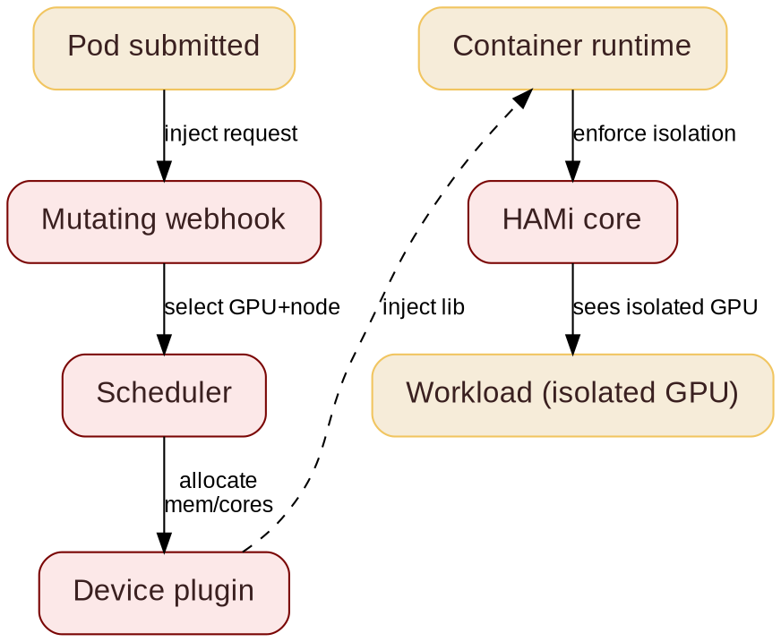

@kicker HAMi - A CNCF Incubation Project
@side-image assets/snow/kubecon-jp-qr.png
# Shared GPU Scheduling & Proactive Autoscaling

@subtitle A Production Blueprint for 1000+ GPUs

@speaker name="Jeonghyun Kim" role="AI Engineer, SNOW Corp." github=github.com/jeonghyunkeem linkedin=linkedin.com/in/jeonghyun-kim-2399a6203
@speaker name="Reza Jelveh" role="GTM & Solution Architecture @ Dynamia AI  -  Makers of HAMi" github=github.com/rezajelveh linkedin=linkedin.com/in/rezajelveh

---

@layout image-right

## The Challenge at Scale

@subtitle 200M Users, 1000+ GPUs, 1200+ Workflows

SNOW Corp., subsidiary of NAVER, manages 1000+ A100 GPUs serving 200M users across three top-ranked GenAI applications  -  SNOW, EPIK, B612  -  handling extreme traffic volatility from viral AI trends.

- {icon:trophy cls=accent-primary} 3 apps in a16z Top 50 Gen AI Mobile Apps
- {icon:users cls=accent-primary} #1 Camera/Photo app in Korea, Japan, Vietnam
- {icon:download cls=accent-primary} 1.5B+ cumulative downloads


---

## Three Workload Challenges

@subtitle Continuous evolution, traffic volatility, heterogeneous workflows

::: grid {cols=3}
::: card {tag=cyan}
### {icon:rocket cls=accent-primary} Continuous Service Evolution

Market leadership needs a constant stream of new GenAI filters: rapid model deployment and frequent updates with no service interruption.
:::
::: card {tag=red}
### {icon:trending-up cls=accent-secondary} Extreme Traffic Volatility

Viral AI trends such as the Ghibli Filter trigger unpredictable surges up to 700%, making static capacity planning impossible.
:::
::: card {tag=yellow}
### {icon:layers cls=accent-contrast} Heterogeneous Inference Workflows

A diverse filter lineup mixes compute-heavy and memory-intensive work, so one-size-fits-all allocation is inefficient.
:::
:::

---

## Talk Overview

@subtitle Shared GPU Scheduling & Proactive Autoscaling

**What you'll learn:**

- {icon:cpu cls=accent-primary} Integrating HAMi for vGPU virtualization
- {icon:trending-up cls=accent-primary} Extending KEDA with custom Consumer Saturation metric
- {icon:globe cls=accent-primary} Multi-region scaling via Helm GitOps

**Concrete results:** 55% GPU waste cut, 91% faster recovery during surges.

---

# Part 1: The Problem

@subtitle GPU underutilization, atomic allocation, multi-tenant contention

---

@layout image-right

## The Problem

@subtitle Atomic GPU allocation wastes silicon

Kubernetes allocates GPUs atomically. DRA + HAMi fix this.

- 1 GB task blocks an 80 GB device
- Over-provisioning is the default: idle silicon
- DRA can request GPUs but requires MIG to slice
- Why HAMi if DRA slices? Covered in Part 2


---

## What is HAMi

@subtitle Static allocation, one GPU per task

<!--
GPUs are expensive and often underutilized. HAMi is a heterogeneous GPU sharing framework for Kubernetes. It lets you slice and share GPUs across workloads, maximizing utilization without rewriting your entire stack.
-->


---

## What is HAMi
@transition none

@subtitle Fractional vGPUs, multiple tasks per device


---

@layout compare

## The GPU Challenge

@subtitle What breaks, what HAMi needs to solve

::: card {tag=compare}
### Problem

- GPUs are scarce, allocated whole
- Vendors locked in, supply tight
- Utilization stuck at ~30%
- No central observability
- Fragmented inference workloads
:::

::: arrow

{icon:arrow-right cls=accent-primary size=48}
:::

::: card {tag=compare}
### Requirements

- Hardware agnostic: one API, any accelerator
- Fractional GPU: 1MB slices, multiple tasks per device
- Advanced scheduling: binpack, spread, topology-aware
:::

<!--
Heterogeneous GPU sharing means you can run NVIDIA A100s, H100s, Ascend or other devices on the same cluster without manual partitioning. HAMi handles the scheduling logic. The real work is memory isolation.
-->

::: notes{ tag="green" }
Unified observability, 50% GPU utilization, 10x workloads running, 10x GPU availability. AMD MI355X: 80% of B200 perf at ~1/3 the cost. Not everyone needs Vera Rubin.
:::

---

# Part 2: The Solution

@subtitle Fractional GPU allocation and scheduling

---

## DRA Feature Timeline

@subtitle KEPs and their development status: not covered today

<!--
Backup slide. Shows all DRA KEPs and their dev status. Mention that DRA is moving fast -- 1.34 stable. We will skip this but it is here for questions.
-->


---

@layout image-right

## DRA: ResourceSlice

@subtitle Per-node device inventory

<!--
DRA drivers run on each node and publish available devices. The scheduler reads ResourceSlices to find nodes that can satisfy a claim. This is how the scheduler knows what hardware is free.
-->


- **ResourceSlice:** lists all available devices on a node with their attributes
- DRA drivers publish slices; scheduler reads them to match claims to devices
- Tied to a node via `nodeName`, supports topology and NUMA attributes

---

@layout image-right

## DRA: ResourceClaim

@subtitle A standardized way to request hardware: not just GPUs. Stable in K8s 1.34.

<!--
DeviceClass defines a category of devices by capability. ResourceClaim requests specific hardware from that category. ResourceClaimTemplate creates a claim per pod automatically. Together these replace the old device plugin model.
-->


- **DeviceClass:** groups devices with identical resource models. **ResourceClaim:** a workload's ticket to hardware. **ResourceClaimTemplate:** reusable blueprint, auto-creates a claim per Pod.

---

## HAMi Capabilities

@subtitle Six things HAMi brings to GPU scheduling

<!--
Six capabilities. The key ones for this talk: hard isolation, advanced scheduling, and unified monitoring. Heterogeneous management is the differentiator -- not just NVIDIA.
-->

::: grid {cols=2}
::: card
### {icon:layers cls=accent-primary} Heterogeneous Management

Manage GPU, NPU, MLU, and other accelerators in one workflow.
:::
::: card
### {icon:shield-check cls=accent-primary} Hard Isolation

Slice memory and compute with hard isolation at runtime.
:::
::: card
### {icon:git-branch cls=accent-contrast} Advanced Scheduling

Binpack, spread, and topology-aware placement policies.
:::
::: card
### {icon:box cls=accent-primary} Kubernetes Native

Kubernetes-native APIs, DRA, and CDI support.
:::
::: card
### {icon:gauge cls=accent-primary} Resource Isolation & QoS

Memory and core quotas for fair, stable sharing.
:::
::: card
### {icon:chart-bar cls=accent-contrast} Unified Monitoring

Consistent metrics and visibility across vendors.
:::
:::


---

@layout two-col

## How HAMi Works

@subtitle Pod creation to GPU isolation

<!--
Seven stages from pod submission to isolated GPU. The mutating webhook injects the request, the HAMi core library enforces isolation via symbolic hijacking: no kernel modules.
-->

HAMi intercepts pod creation and GPU allocation through seven stages:

- **Mutating webhook:** injects device request into pod spec
- **Scheduler:** selects GPU and node via HAMi scheduler plugin
- **Device plugin:** allocates GPU memory and compute cores
- **Container runtime:** injects HAMi-Core library into container
- **HAMi core:** enforces isolation in-process via symbolic hijacking

@col



---

@layout two-col

## GPU Sharing

@subtitle Dynamic fine-grained device slicing

<!--
Same YAML across vendors. Ascend example on the right. Memory is hard limit, cores are best-effort. This is what users actually write.
-->

- **NVIDIA, Ascend, Cambricon, Hygon, Iluvatar** supported
- **Fine-grained:** as small as 1MB device memory, 1% computing cores
- **Transparent to tasks:** no code changes required
- **Hard resource isolation** inside containers
- One API across vendors: same YAML, any accelerator

@col

```yaml
# Ascend 910C: 8GB + 20% compute
resources:
  limits:
    huawei.com/Ascend910C: "1"
    huawei.com/Ascend910C-core: "20"
    huawei.com/Ascend910C-memory: "8192"
```

```yaml
# NVIDIA: 3GB on any GPU
resources:
  limits:
    nvidia.com/gpu: 1
    nvidia.com/gpumem: 3000
```


---

## GPU Utilization Impact
@hidden

@subtitle Idle tasks swap to host RAM

Idle tasks swap to host RAM, freeing device memory for active workloads:

::: card
```seaborn
import matplotlib.pyplot as plt
from matplotlib.patches import FancyBboxPatch

fig, ax = plt.subplots(figsize=(8, 2.8))

fg = plt.rcParams["text.color"]
dimmed = plt.rcParams["xtick.color"]
cmap = plt.get_cmap("Paired")
danger = cmap(4.5 / 12)
danger_bright = cmap(5 / 12)
elastic = cmap(2.5 / 12)
base = cmap(0.5 / 12)
ax.set_facecolor("none")
fig.patch.set_alpha(0)

r = 0.14
bs = f"round,pad={r}"

# Row 1: base=8, spike=3
ax.barh(1, 8, color=base, height=0.65)
ax.barh(1, 3, left=8, color=danger, height=0.65)
ax.plot([10, 10], [0.62, 1.38], color=danger, linewidth=2.5, solid_capstyle="butt")

# Row 2: base=8, spike=7
ax.barh(0, 8, color=base, height=0.65)
ax.barh(0, 7, left=8, color=elastic, height=0.65)
ax.plot([10, 10], [-0.38, 0.38], color=fg, linewidth=1.5, linestyle="--")
ax.plot([15, 15], [-0.38, 0.38], color=fg, linewidth=1.5, linestyle="--")

ax.set_xlim(0, 15.2)
ax.spines[["top", "right", "left", "bottom"]].set_visible(False)
ax.tick_params(left=False, bottom=False, labelleft=False, labelbottom=False)

ax.text(0, 1.38, "Without HAMi", ha="left", va="bottom", fontsize=10, color=fg, fontweight="bold")
ax.text(0, 0.38, "With HAMi: Elastic Scaling", ha="left", va="bottom", fontsize=10, color=fg, fontweight="bold")

ax.text(4, 1, "Normal base load", ha="center", va="center", fontsize=9, color=fg, fontweight="bold")
ax.text(9.5, 1, "Traffic spike", ha="center", va="center", fontsize=7.5, color=dimmed, fontweight="bold")
ax.text(10, 1.42, "10 GB limit", ha="center", va="bottom", fontsize=8, color=danger_bright, fontweight="bold")

ax.text(4, 0, "Normal base load", ha="center", va="center", fontsize=9, color=fg, fontweight="bold")
ax.text(11.5, 0, "Traffic spike", ha="center", va="center", fontsize=7.5, color=dimmed, fontweight="bold")
ax.text(10, -0.42, "10 GB\nsoft limit", ha="center", va="top", fontsize=7.5, color=dimmed)
ax.text(15, -0.42, "15 GB\nburst", ha="center", va="top", fontsize=7.5, color=dimmed)
```
:::

:::card
```seaborn
import matplotlib.pyplot as plt

fig, ax = plt.subplots(figsize=(8, 2.8))

fg = plt.rcParams["text.color"]
dimmed = plt.rcParams["xtick.color"]
cmap = plt.get_cmap("Paired")
green = cmap(2.5 / 12)
blue = cmap(0.5 / 12)
red = cmap(4.5 / 12)
grey = "#9ca3af"
sleep_bg = "#374151"

ax.set_facecolor("none")
fig.patch.set_alpha(0)

# Top: IDLE(25) + EXECUTING(50) + IDLE(25)
ax.barh(1, 25, color=grey, height=0.65)
ax.barh(1, 50, left=25, color=green, height=0.65)
ax.barh(1, 25, left=75, color=grey, height=0.65)

# Bottom: EXECUTING(25) + SLEEP(50) + EXECUTING(25)
ax.barh(0, 25, color=blue, height=0.65)
ax.barh(0, 50, left=25, color=sleep_bg, height=0.65)
ax.barh(0, 25, left=75, color=blue, height=0.65)

# Segment dividers
for x in [25, 75]:
    ax.plot([x, x], [0.62, 1.38], color=fg, linewidth=0.8, linestyle="--")
    ax.plot([x, x], [-0.38, 0.62], color=fg, linewidth=0.8, linestyle="--")

ax.set_xlim(0, 100)
ax.spines[["top", "right", "left", "bottom"]].set_visible(False)
ax.tick_params(left=False, bottom=False, labelleft=False, labelbottom=False)

# Side labels
ax.text(0, 1.38, "HIGH PRIORITY", ha="left", va="bottom", fontsize=10, color=green, fontweight="bold")
ax.text(0, 0.38, "LOW PRIORITY", ha="left", va="bottom", fontsize=10, color=blue, fontweight="bold")

# Top bar labels
ax.text(12.5, 1, "IDLE", ha="center", va="center", fontsize=9, color=fg)
ax.text(50, 1, "EXECUTING", ha="center", va="center", fontsize=9, color=fg, fontweight="bold")
ax.text(87.5, 1, "IDLE", ha="center", va="center", fontsize=9, color=fg)

# Bottom bar labels
ax.text(12.5, 0, "EXECUTING", ha="center", va="center", fontsize=9, color=fg)
ax.text(50, 0, "SLEEP", ha="center", va="center", fontsize=9, color=red, fontweight="bold")
ax.text(87.5, 0, "EXECUTING", ha="center", va="center", fontsize=9, color=fg)

ax.text(50, -0.35, "CUDA-KERNEL BOUNDARY", ha="center", va="top", fontsize=7, color=red)
```
:::

---

## Priority Preemption

@subtitle High priority pauses low priority at kernel boundaries

<!--
HIGH PRIORITY tasks preempt LOW PRIORITY at CUDA kernel boundaries. No wasted compute. The kernel boundary is the key -- you cannot preempt mid-kernel.
-->
@hidden

High-priority tasks preempt low-priority ones at CUDA kernel boundaries: no wasted compute, clean context switch:

:::card
```seaborn
import matplotlib.pyplot as plt

fig, ax = plt.subplots(figsize=(8, 2.8))

fg = plt.rcParams["text.color"]
dimmed = plt.rcParams["xtick.color"]
cmap = plt.get_cmap("Paired")
green = cmap(2.5 / 12)
blue = cmap(0.5 / 12)
red = cmap(4.5 / 12)
grey = "#9ca3af"
sleep_bg = "#374151"

ax.set_facecolor("none")
fig.patch.set_alpha(0)

# Top: IDLE(25) + EXECUTING(50) + IDLE(25)
ax.barh(1, 25, color=grey, height=0.65)
ax.barh(1, 50, left=25, color=green, height=0.65)
ax.barh(1, 25, left=75, color=grey, height=0.65)

# Bottom: EXECUTING(25) + SLEEP(50) + EXECUTING(25)
ax.barh(0, 25, color=blue, height=0.65)
ax.barh(0, 50, left=25, color=sleep_bg, height=0.65)
ax.barh(0, 25, left=75, color=blue, height=0.65)

# Segment dividers
for x in [25, 75]:
    ax.plot([x, x], [0.62, 1.38], color=fg, linewidth=0.8, linestyle="--")
    ax.plot([x, x], [-0.38, 0.62], color=fg, linewidth=0.8, linestyle="--")

ax.set_xlim(0, 100)
ax.spines[["top", "right", "left", "bottom"]].set_visible(False)
ax.tick_params(left=False, bottom=False, labelleft=False, labelbottom=False)

# Side labels
ax.text(0, 1.38, "HIGH PRIORITY", ha="left", va="bottom", fontsize=10, color=green, fontweight="bold")
ax.text(0, 0.38, "LOW PRIORITY", ha="left", va="bottom", fontsize=10, color=blue, fontweight="bold")

# Top bar labels
ax.text(12.5, 1, "IDLE", ha="center", va="center", fontsize=9, color=fg)
ax.text(50, 1, "EXECUTING", ha="center", va="center", fontsize=9, color=fg, fontweight="bold")
ax.text(87.5, 1, "IDLE", ha="center", va="center", fontsize=9, color=fg)

# Bottom bar labels
ax.text(12.5, 0, "EXECUTING", ha="center", va="center", fontsize=9, color=fg)
ax.text(50, 0, "SLEEP", ha="center", va="center", fontsize=9, color=red, fontweight="bold")
ax.text(87.5, 0, "EXECUTING", ha="center", va="center", fontsize=9, color=fg)

ax.text(50, -0.35, "CUDA-KERNEL BOUNDARY", ha="center", va="top", fontsize=7, color=red)
```
:::

---

## Memory Oversubscription
@hidden

<!--
23 GB device + 46 GB virtual = 3x models. GPU memory swapped to host RAM for idle tasks. Works for model loading and inference, not for active training.
-->

@subtitle 23 GB device + 46 GB virtual = 3x models

@layout compare

::: card {tag=compare}
### Before

23GB Device Memory hosts **1** 13B inference model
:::

::: arrow

{icon:arrow-right cls=accent-primary size=48}
:::

::: card {tag=compare}
### After

23GB Device + 46GB virtual memory hosts **3** 13B inference models
:::

::: notes{ tag="green" }
GPU memory automatically swapped to host RAM for idle tasks. Typical scenario: model loading and inference serving.
:::

---

## GPU Sharing Parameters

@subtitle Fine-grained control per task
@hidden

- : GPU memory size, defaults to all available
- : compute percentage, 0-100

---

@layout image-right

## Scheduling Policies

@subtitle Binpack & Spread

<!--
Two axes, four patterns. Node binpack saves money, node spread saves uptime. GPU binpack saves whole GPUs for training, GPU spread saves tail latency. Pick based on workload: training wants binpack, inference with SLOs wants spread.
-->


- **Node binpack** frees whole machines: reduces cost, helps cluster autoscaler
- **Node spread** isolates faults: HA across zones, blast radius control
- **GPU binpack** prevents fragmentation: frees entire GPUs for training
- **GPU spread** protects tail latency: reduces HBM and NVLink contention
- Advanced scheduling works with standalone HAMi; DRA mode can use Yunikorn or Volcano

---

@layout image-right

## Scheduling Policies

@subtitle Topology-Aware

<!--
NVLink vs PCIe is a 7-14x bandwidth gap. HAMi schedules multi-GPU workloads to NVLink-connected pairs, avoids PCIe bridge pairs. Ascend uses HCCS, other vendors have their own high-speed interconnects: same topology logic applies. This matters for tensor parallelism and large-model training.
-->


- **NVLink 3 (A100):** 600 GB/s, 12 links
- **NVLink 4 (H100/H200):** 900 GB/s bidirectional across 18 links
- **NVLink 5 (B200/B300):** 1.8 TB/s, 14x PCIe 5.0
- **NVLink 6 (Rubin):** ~3.6 TB/s target
- **PCIe 5.0 x16:** 128 GB/s. **PCIe 6.0:** 242 GB/s
- **HAMi topology policy:** prefers NVLink (NVIDIA), HCCS (Ascend), and other high-speed interconnects, avoids PCIe bridge pairs

---


## GPU Sharing Approaches

@subtitle MIG vs HAMi vs HAMi+DRA vs NVIDIA DRA

<!--
Common question: why not just use MIG? MIG doesn't work on all devices. You need to manually load MIG templates. HAMi does it automatically based on workload choice. NVIDIA's DRA driver has limited slicing. DRA itself still lacks advanced scheduling.
-->

| Capability | MIG | HAMi | HAMi+DRA | NVIDIA DRA |
|------------|:---:|:---:|:---:|:---:|
| Pre-configured templates | {icon:x cls=accent-secondary} | {icon:check cls=accent-primary} | {icon:check cls=accent-primary} | {icon:x cls=accent-secondary} |
| Dynamic MIG repartition | {icon:x cls=accent-secondary} | {icon:check cls=accent-primary} | {icon:check cls=accent-primary} | {icon:x cls=accent-secondary} |
| Symbolic hijacking (1MB slice) | {icon:x cls=accent-secondary} | {icon:check cls=accent-primary} | {icon:check cls=accent-primary} | {icon:x cls=accent-secondary} |
| Multi-vendor | {icon:x cls=accent-secondary} | {icon:check cls=accent-primary} | {icon:check cls=accent-primary} | {icon:x cls=accent-secondary} |
| Advanced scheduling | {icon:x cls=accent-secondary} | {icon:check cls=accent-primary} | {icon:x cls=accent-secondary} | {icon:x cls=accent-secondary} |

MIG needs preconfigured GPU profiles. HAMi creates dynamic MIG partitions based on workload, and also uses symbolic hijacking for slices as small as 1MB. NVIDIA DRA is MIG-only: no repartitioning, no hijacking, no multi-vendor, no advanced scheduling (yet).


---
# Part 3: Legacy & Migration

@subtitle Static Docker, GPU fragmentation, operational overload

---

## Workload Challenges

@subtitle System instability, inefficiency, operational overload

::: grid {cols=2}
::: card {tag=red}
### {icon:triangle-alert cls=accent-secondary} System Instability

No centralized monitoring or recovery. Serving instability directly impacted 200M users.
:::
::: card {tag=yellow}
### {icon:chart-pie cls=accent-contrast} Inefficient Utilization

Static allocation caused GPU fragmentation. Resources wasted, performance unpredictable.
:::
:::

::: card {tag=cyan}
### {icon:hard-drive cls=accent-primary} Operational Overload

No automatic recovery. Manual intervention drove up staff workload and operational costs.
:::

---

@layout image-right

## The Legacy: Static Docker

@subtitle Manual GPU binding, no centralized control


- Manual GPU binding per host
- Local volume containers
- Isolated Docker hosts with no centralized control
- No sharing between GPUs  -  each pod consumed a full device

---

@layout compare
@variant dark

## Infrastructure Evolution

@subtitle From Docker silos to Kubernetes + HAMi

::: card {tag=compare}
### AS-IS: Legacy Docker


- Manual GPU binding
- Isolated hosts
- Static allocation
- Low utilization.
  :::

::: arrow

{icon:arrow-right cls=accent-primary size=48}
:::

::: card {tag=compare}
### TO-BE: Kubernetes + HAMi

- Centralized control plane
- Dynamic node pools
- vGPU sharing enabled
- Automated recovery + scaling

:::

---

# Part 4: Methodology

@subtitle How SNOW Fixed It

---

@layout image-right

## Building a Cloud-Native Foundation

@subtitle Multi-region on-premise HA with decoupled ETCD

| Project | Role |
|---------|------|
| Kubernetes | Container orchestration |
| Cilium | High-performance CNI |
| HAMi | GPU sharing scheduler |
| KEDA | Autoscaling |
| Helm | Service configuration |
| Prometheus + Grafana | Monitoring |
| Traefik | Ingress / reverse proxy |

Multi-region on-premise HA clusters with decoupled ETCD topology for production survivability.

@col


---

@layout image-right

## Helm-Based Service Deployment

@subtitle Standardized deployment via GitOps


Standardized deployment via Helm Charts. Sync between charts and clusters performed by CI/CD pipeline (GitHub Actions).

---

## GPU Sharing: The Migration Hurdle

@subtitle Train-to-Inference pipeline blocked by GPU isolation

Kubernetes' strict GPU isolation blocked the sequential "Train-to-Inference" pipeline.


**Problem:** Default scheduler cannot share one GPU across containers.

**Without HAMi:** 2x GPU usage or massive code rewrite.

---

@layout image-right

## Migration Solution: HAMi vGPU

@subtitle Device sharing without code changes


- **Device sharing:** Multiple containers share one GPU concurrently
- **Zero code changes:** Install via Helm, assign GPUs in chart
- **Kubernetes-native:** Parallel with kube-scheduler, no conflicts

Result: flexible GPU scheduling comparable to Docker, with enhanced utilization and stability.

---

## Proactive GPU Orchestration

@subtitle Why conventional metrics miss GPU saturation

SNOW's inference fleet is heterogeneous, so utilization and saturation are not the same signal.

::: grid {cols=2}
::: card {tag=red}
### {icon:chart-pie cls=accent-secondary} Inaccurate Saturation Signal

CPU and RAM miss real service load. Even DCGM GPU utilization is unreliable: varying workflow intensities mean high utilization does not imply saturation, and vice versa.

Training runs near 80% compute and 20% memory. Inference has the opposite profile.
:::
::: card {tag=yellow}
### {icon:clock cls=accent-contrast} Lagging Indicator

KEDA's built-in RabbitMQ scaler triggers on queue length, so it only reacts once a backlog exists.

With a 60 second model warm-up, that is already too late: requests are throttled before new workers can serve.
:::
:::

---

@layout image-right

## Custom KEDA Metric Server

@subtitle Consumer Saturation: unacked messages / active consumers

SNOW built a lightweight Python metric server that exposes real-time RabbitMQ consumer state to the Kubernetes HPA through KEDA's Metrics API.

- {icon:calculator cls=accent-primary} `active_ratio = unacked / consumers`, scaling out above a **0.7** threshold
- {icon:zap cls=accent-primary} Provisions GPUs **before** the pool saturates, creating a buffer that absorbs the 60s warm-up
- {icon:timer cls=accent-primary} Longer stabilization and cooldown windows prevent premature scale-in during traffic lulls

@col


---

## From Wasted to Secured GPU Time

@subtitle GPU allocation tracks real-time user traffic


Static provisioning burns **wasted GPU time** when supply sits above traffic (orange), and still drops **unserved spikes** (red). After autoscaling, allocation tracks demand closely (green).

---

# Part 5: Results

@subtitle What SNOW Achieved

---

## Quantitative Results

@subtitle Fewer GPUs, less idle time, faster recovery

::: card {metric}
2x
Fewer GPUs for train plus inference pipelines
:::
::: card {metric}
-55%
Average GPU time per production cluster
:::
::: card {metric}
-91%
MTTR, from ~2hr to ~10min
:::
::: card {metric}
-85%
GPU surge errors during peak traffic
:::

---

## Operational Impact

@subtitle Autonomy, velocity, and headroom

| Metric | Improvement |
|--------|-------------|
| Batch process time | -81% (~6hr → <1hr) |
| Release cycle | 1-2 months → days |
| Operations reclaimed | 10.8 man-months |
| Peak traffic | 700% spike, zero downtime |

---

@layout image-right

## Error Reduction: Before vs After

@subtitle 85 percent drop in GPU surge errors


GPU surge-related user errors dropped 85% after KEDA-based GPU orchestration deployed (May 2025).

---

@variant dark
@layout image-left

## Hybrid Cloud Bursting: 700% Spike

@subtitle Ghibli Filter traffic surge handled with zero downtime


During the viral "Ghibli Filter" trend:
- Traffic tripled in 3 hours on a low-staff Saturday
- Autoscaling initially held, then GPU saturation hit
- Expanded from on-prem to CSP clusters via GitOps
- Unified Helm charts deployed across all regions

Achieved 7x peak consumption without service interruption.

---

@layout image-right

## Multi-Cluster Bursting Architecture

@subtitle One GitOps pipeline across on-premise and CSP regions

To overcome on-premise capacity limits, the system expanded into Cloud Service Provider regions.

- {icon:git-branch cls=accent-primary} Identical Helm charts deployed to every cluster via GitOps
- {icon:server cls=accent-primary} On-premise Regions A and B, burst into CSP Regions C and D
- {icon:link cls=accent-primary} CSP worker nodes consume from the central RabbitMQ over a secured connection

@col


---

@layout image-right

## GPU Monitoring Dashboard

@subtitle Full fleet visibility


Full visibility into GPU utilization, scheduling, and autoscaling across the entire fleet.

---

## Key Takeaways

@subtitle Production blueprint, GPU sharing, proactive scaling

::: grid {cols=3}
::: card {tag=green}
### {icon:shield-check cls=accent-primary} Production Blueprint

CNCF ecosystem provides production-grade foundation for AI workloads at scale. HAMi + KEDA = proven at 200M users.
:::
::: card {tag=cyan}
### {icon:cpu cls=accent-contrast} GPU Sharing

HAMi enables efficient GPU utilization without code changes  -  critical for migration from legacy Docker setups.
:::
::: card {tag=yellow}
### {icon:chart-bar cls=accent-contrast} Proactive Scaling

Custom KEDA metrics beat reactive scaling for GPU workloads with warm-up latency. Consumer Saturation is the key metric.
:::
:::

---

# Part 6: Where HAMi Is Today

@subtitle Adoption, Case Studies, Community 

---

@hidden
## Applicable Scenarios

@subtitle Online inference, A/B testing, mixed workloads

<!--
Four scenarios HAMi enables. Key message: GPU sharing is not one-size-fits-all. Online inference saves cost, A/B testing saves hardware, mixed train/infer keeps GPUs busy, LLM optimization fits more models per device.
-->

::: grid {cols=2}
::: card {tag=green}
### {icon:globe cls=accent-primary} Online Inference

10 services share one GPU. Activate on-demand, low-frequency services share resources. Significantly reduces GPU costs.
:::
::: card {tag=cyan}
### {icon:git-compare-arrows cls=accent-contrast} A/B Testing

Virtual GPU memory reduces hardware requirements. Original + experimental models share a single GPU.
:::
:::

::: grid {cols=2}
::: card {tag=yellow}
### {icon:refresh-cw cls=accent-contrast} Mixed Train/Infer

Inference gets priority, training fills gaps. When inference idle, cached training runs. Flexible queue-based scheduling.
:::
::: card {tag=cyan}
### {icon:zap cls=accent-primary} LLM Optimization

Multiple small models (embedding, reranker, generator) share GPUs. 4 threads → 8 threads on same hardware.
:::
:::

---

@layout metrics
## Where HAMi Is Today

@subtitle HAMi in Production: 7 case studies, more coming

::: grid {cols=4}
::: card {metric}
3x
GPU density
:::
::: card {metric}
10x
Workloads per device
:::
::: card {metric}
80%
Less ops overhead
:::
::: card {metric}
2x
GPU utilization
:::
:::

@row

::: notes{ tag="green" }
China Merchants Bank · SNOW Corp. · NIO · KE Holdings · DaoCloud · SF Technology · Prep Education · [cncf.io/case-studies](https://www.cncf.io/case-studies/) · Reach out for help submitting yours.
:::

---

@layout ecosystem
## Community & Adopters

@subtitle Devices, integrations, and who uses HAMi

<!--
4.1k stars, 325k pulls, 500+ contributors, 27 countries. 11 device types, 20+ adopters. This is the ecosystem slide -- show the breadth. The QR code links to github.com/Project-HAMi/HAMi.
-->

#### Open Source, CNCF Backed, Production Ready
::: grid {cols=5}
::: card {metric}
4.1k
Github Stars
:::
::: card {metric}
325k
Docker Pulls
:::
::: card {metric}
500+
Contributors
:::
::: card {metric}
27
Contributor Countries
:::
::: card

     
:::
:::

#### Ecosystem & Device Support
::: grid {cols=2}
::: card
    
   
 
:::
:::

#### Adopters
::: grid {cols=2}
::: card
    
    
    
    
:::
:::
---

@kicker Questions
@side-image assets/snow/kubecon-jp-qr.png
# Thank You

@speaker name="Jeonghyun Kim" role="AI Engineer, SNOW Corp." github=github.com/jeonghyunkeem linkedin=linkedin.com/in/jeonghyun-kim-2399a6203
@speaker name="Reza Jelveh" role="GTM & Solution Architecture @ Dynamia AI  -  Makers of HAMi" github=github.com/rezajelveh linkedin=linkedin.com/in/rezajelveh
